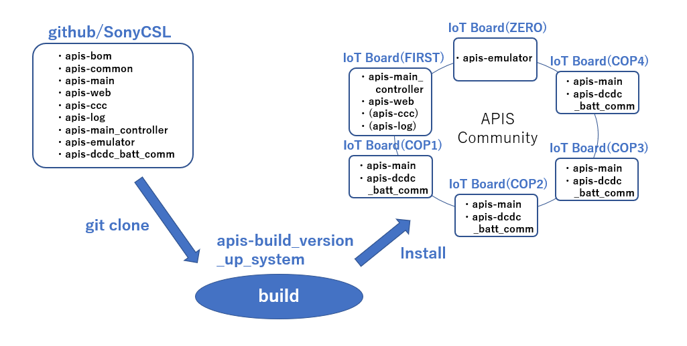
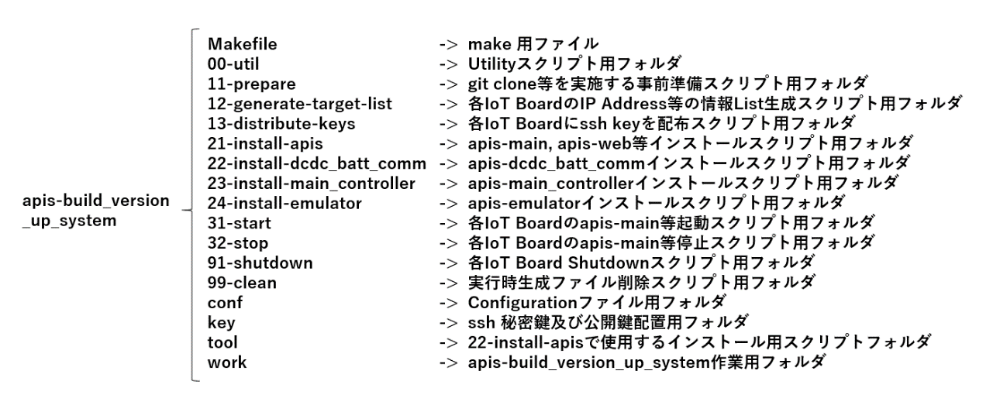
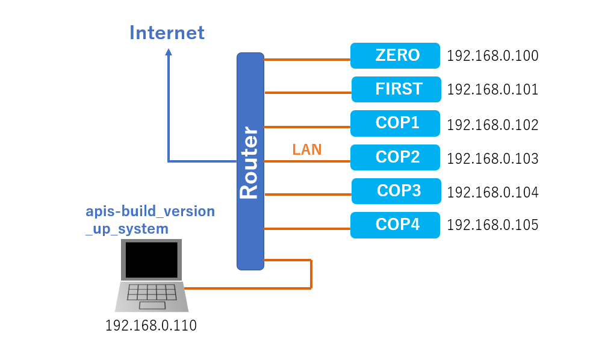

**apis-build\_version\_up\_system**
=====
**Rev 0.61**

# **目次**
- [**apis-build\_version\_up\_system**](#apis-build_version_up_system)
- [**目次**](#目次)
- [**1. 用語・略語**](#1-用語略語)
- [**2. 概要**](#2-概要)
- [**3. ソフトウェア構成**](#3-ソフトウェア構成)
- [**4. 各種フォルダ及びファイル説明**](#4-各種フォルダ及びファイル説明)
  - [**4.1. apis-build\_version\_up\_systemのフォルダ及びファイル説明**](#41-apis-build_version_up_systemのフォルダ及びファイル説明)
  - [**4.2. CopInfoTransformerによって生成されるファイル**](#42-copinfotransformerによって生成されるファイル)
  - [**4.3. 実行中に生成されるLogファイル**](#43-実行中に生成されるlogファイル)
- [**5. Configurationファイルについて**](#5-configurationファイルについて)
  - [**5.1. cop-\*.xmlファイルについて**](#51-cop-xmlファイルについて)
  - [**5.2. installer.confファイルについて**](#52-installerconfファイルについて)
  - [**5.3. make.confファイルについて**](#53-makeconfファイルについて)
- [**6. OSSライセンス**](#6-ossライセンス)
- [**7. 事前準備について**](#7-事前準備について)
  - [**7.1. IoT Boardの準備例**](#71-iot-boardの準備例)
  - [**7.2. Configrationファイルの準備例**](#72-configrationファイルの準備例)
  - [**7.3. IoT BoardへのInstall環境例**](#73-iot-boardへのinstall環境例)

# **1. 用語・略語**

<table>
<thead>
<tr class="header">
<th><strong>用語</strong></th>
<th><strong>説明</strong></th>
</tr>
</thead>
<tbody>
<tr class="odd">
<td>apis-main</td>
<td>自律分散制御を可能にするSony CSLが開発した電力相互融通ソフトウェアである。(詳細はapis-main仕様書を参照。)</td>
</tr>
<tr class="even">
<td>apis-web</td>
<td>apis-mainがインストールされた各ノードの固有情報や、ノード間の電力融通に関わる情報をMain Controllerへ提供するソフトウェアである。(詳細はapis-web仕様書を参照。)</td>
</tr>
<tr class="odd">
<td>apis-ccc</td>
<td>apis-mainがインストールされた各ノードの固有情報や、ノード間の電力融通に関わる情報をService Center等のServerへ提供するソフトウェアである。(詳細はapis-ccc仕様書を参照。)</td>
</tr>
<tr class="even">
<td>apis-log</td>
<td>
apis-main等がUDP出力するMessageやError情報を取得しService Center等のServerへ提供するソフトウェアである。

(詳細はapis-log仕様書を参照。)
</td>
</tr>
<tr class="odd">
<td>apis-main_controller</td>
<td>
apis-mainがインストールされた各ノードの状態や電力融通状態をリアルタイムで表示するSony CLSが開発したWebアプリケーションのソフトウェアである。

(詳細はapis-main_controller仕様書を参照。)
</td>
</tr>
<tr class="even">
<td>apis-emulator</td>
<td>
蓄電池や電力融通用DC/DC Converter等を含んだハードウェア環境をコンピュータ上で再現し、日射量と住宅の消費電力量情報を読み込み、複数の住宅の発電と消費、蓄電池の充放電等の電力の流れをエミュレーションできるソフトウェアである。

(詳細はapis-emulator仕様書を参照。)
</td>
</tr>
<tr class="odd">
<td>apis-dcdc_batt_comm</td>
<td>
Sony CSLが開発したEZA2500を制御しBattery情報を取得するDevice Driverである。

(詳細はapis-dcdc_batt_comm仕様書を参照。)
</td>
</tr>
<tr class="even">
<td>EZA2500</td>
<td>本文ではTDKラムダ製EZA2500シリーズのカスタム品であるEZA-2500-32048SC0を指す。</td>
</tr>
<tr class="odd">
<td>COP</td>
<td>Computer for Operating the Programの略でAPIS関連ソフトウェアが動作する処理装置を指す。</td>
</tr>
</tbody>
</table>

 

# **2. 概要**

apis-build\_version\_up\_systemは図2-1で示すようにgithub/SonyCSLからAPISの評価環境を構築するために必要なソフトウェアを一括でgit cloneし、git cloneしたソフトウェアのBuildを実行し、ConfigurationファイルからAPISの動作に必要な各種設定ファイルを生成後、複数のノード(本件の場合はIoT Boardを想定)それぞれに一括インストールすることが可能なソフトウェアである。このソフトウェアを使用することで複数のノードを用いたAPIS評価環境を簡単に構築することが可能である。Defaultで構築されるAPIS評価環境は、apis-emulatorが動作するノード(図2-1 : IoT Board(ZERO))、apis-main\_controllerとapis-webが動作するノード(図2-1 : IoT Board(FIRST))、apis-mainとdcdc\_batt\_commが動作するノード(図2-1 : IoT Board(COP1～COP4))で構成されるが、これらのAPIS評価環境はConfigurationファイルを修正することにより構成を変更することが可能である。

  
図2-1

 

# **3. ソフトウェア構成**

apis-build\_version\_up\_systemのフォルダは図3-1の構成になっている。それぞれのフォルダとフォルダ内のファイルの詳細説明は “4.各種フォルダ及びファイル説明”にて説明する。  
make コマンドを実行することでgithub/SonyCSLからのgit cloneや、ソフトウェアのBuild、そして各ノードへのソフトウェアのインストールなど各種処理を実行する。  
conf フォルダにはConfigurationファイルとしてinstaller.confとcop-\*.xmlの2つのファイルが存在し、これらの設定を変更することでAPIS評価環境の構成を変えることが可能である。

  
図3-1

 

# **4. 各種フォルダ及びファイル説明**
    
## **4.1. apis-build\_version\_up\_systemのフォルダ及びファイル説明**

apis-build\_version\_up\_systemフォルダに収められているフォルダやファイルを以下に説明する。

<table>
<tbody>
<tr class="even">
<td colspan="2">Makefile</td>
<td>
apis-build_version_up_systemのMakefile。

以下にメインで使用するMakefileのTargetを記載する。

prepare : 以下の処理を実行する。 
&emsp;11-prepare/main.sh 
&emsp;12-generate-target-list/main.sh 
&emsp;13-distribute-keys/main.sh 

install : 以下の処理を実行する。 
&emsp;21-install-apis/main.sh 
&emsp;22-install-dcdc_batt_comm/main.sh 
&emsp;23-install-main_controller/main.sh 
&emsp;24-install-emulator/main.sh

start : 以下の処理を実行する。 
&emsp;31-start/main.sh

stop : 以下の処理を実行する。 
&emsp;32-stop/main.sh

shutdown : 以下の処理を実行する。 
&emsp;91-shutdown/main.sh

clean : 以下の処理を実行する。 
&emsp;99-clean/main.sh
</td>
<tr class="odd">
<td rowspan="3">00-util</td>
<td>main.sh</td>
<td>1. conf/installer.confを読み込む。 
2. WORK_DIR, APIS_INSTALLER＿DIRのアドレスを指定する。 
3. COP_XMLに/conf/cop-*.xmlを指定する。 
4. echoで以下の値をLogに出力する。 
&emsp;WORK_DIR 
&emsp;APIS_INSTALLER_DIR 
&emsp;COP_COMMUNITY 
&emsp;APIS_VERSION 
&emsp;COP_XML 
5. DO_MAINを実行する。
</td>
</tr>
<tr class="even">
<td>load_master_key.sh</td>
<td>ssh-agentに/key以下の秘密鍵を渡す。</td>
</tr>
<tr class="odd">
<td>loop_target.sh</td>
<td>/work/taret-list.txtを読み込み、複数のCOPのノードがあればその数に対して必要な処理を繰り返す。</td>
</tr>
<tr class="even">
<td rowspan="6">11-prepare</td>
<td>main.sh</td>
<td><cop-*.xml、各種設定を読み込む。>1. /00-util/main.shを実行し、ディレクトリのアドレスや cop-*.xml、各種設定を読み込む。 
2. 11-prepare/prepare-key.sh を実行する。 
3. 11-prepare/prepare-ApisInstaller.sh を実行する。 
4. 11-prepare/prepare-dcdc_batt_comm.sh を実行する。 
5. 11-prepare/prepare-main_controller.sh を実行する。 
6. 11-prepare/prepare-emulator.sh を実行する。
</td>
</tr>
<tr class="odd">
<td>prepare-key.sh</td>
<td>
1. /00-util/main.shを実行し、ディレクトリのアドレスやcop-*.xmlや各種設定を読み込む。 
2. ssh-keygenをして/00-util/main.shで読み込んだ MASTER_KEY_NAMEで/keyの下に保存する。</td>
</tr>
<tr class="even">
<td>prepare-ApisInstaller.sh</td>
<td><>
1. /00-util/main.shを実行し、ディレクトリのアドレスや cop-*.xml、各種設定を読み込む。 
2. cd APIS_INSTALLER_DIR を実行する。 (/tool/ApisInstaller へ移動する。) 
3．make prepare を実行し、以下を実行する。 
&emsp;3-1. /tool/ApisInstaller以下にlogとworkのディレクトリを作成する。 
&emsp;3-2. /conf/cop-*.xml の存在を確認する。 
&emsp;3-3. stopExp : ./expの下に main, web, ccc, logの *-stop-*.expの存在を確認する。 
&emsp;3-4. killExp : ./expの下にmain, web, ccc, logの *-kill-*.expの存在を確認する。 
&emsp;3-5. stopKillExp : ./expの下にmain, web, ccc, logの *-stop-kill-*.expの存在を確認する。 
&emsp;3-6. versionupExp : ./expの下にmain, web, ccc, logの *-versionup-*.expの存在を確認する。 
&emsp;3-7. setupfilesExp : ./expの下にmain, web, ccc, logの *-setupfiles-*.expの存在を確認する。 
&emsp;3-8. keycertExp : ./expの下にmain, web, ccc, logの *-keycert-*.expの存在を確認する。 
&emsp;3-9. verifyExp : ./expの下にmain, web, ccc, logの *-verify-*.expの存在を確認する。 
&emsp;3-10. startExp : ./expの下にmain, web, ccc, logの *-start-*.expの存在を確認する。 
&emsp;3-11. retrievelogsExp : ./expの下にmain, web, ccc, logの *-retrievelogs-*.expの存在を確認する。 
&emsp;3-12. clearalarmExp : ./expの下にmain, web, ccc, logの *-retrievelogs-*.expの存在を確認する。 
&emsp;3-13. /tool/ApisInstaller/workの下にgit clone apis-bom.git 後、cd apis-bom → make clean installを実行する。 
&emsp;3-14. /tool/ApisInstaller/workの下に git clone apis-common.git 後、cd apis-common → make clean installを実行する 
&emsp;3-15. /tool/ApisInstaller/workの下に git cloneapis-main.git 後、cd apis-main → make clean packageを実行する。 
&emsp;3-16. /tool/ApisInstaller/workの下に git clone 
&emsp;&emsp;apis-web.git 後、cd apis-web → make clean packageを実行する。 
&emsp;3-17. /tool/ApisInstaller/workの下に git clone 
&emsp;&emsp;apis-ccc.git 後、cd apis-ccc → make clean packageを実行する。 
&emsp;3-18. /tool/ApisInstaller/workの下に git clone apis-log.git 後、cd apis-log → make clean packageを実行する。 
&emsp;3-19. /tool/CopInfoTransformerへ移動後、make clean packageを実行する。
</td>
</tr>
<tr class="odd">
<td>prepare-main_controller.sh</td>
<td>git clone apis-main_controlller.git を実行し/workの下にapis-main_controller一式をCopyする。</td>
</tr>
<tr class="even">
<td>prepare-emulator.sh</td>
<td>
git clone apis-emulator.git を実行し/workの下に

apis-emulator一式をCopyする。
</td>
</tr>
<tr class="odd">
<td>prepare-dcdc_batt_comm.sh</td>
<td>
git clone apis-dcdc_batt_comm.git を実行し/workの下に

apis-dcdc_batt_comm一式をCopyする。
</td>
</tr>
<tr class="even">
<td rowspan="2">12-generate-target-list</td>
<td>main.sh</td>
<td>

1. /00-util/main.shを実行し、ディレクトリのアドレスやcop-*.xml、各種設定を読み込む。 
2. /workの下のtarget-list.txtを削除する。 
3. groovy /12-generate-target-list/generate-target-list.groovyを実行する。 
4. /workの下のtarget-list.txtを作成する。
</td>
</tr>
<tr class="odd">
<td>generate-target-list.groovy</td>
<td>
/conf/installer.confと/conf/cop-*.xmlからtarget-list.txtを作成する。

target-list.txtにはTargetであるノードZERO, FIRST, COPそれぞれのIP Address、Account、Passwordの情報が記載される。
</td>
</tr>
<tr class="even">
<td rowspan="2">13-distribute-keys</td>
<td>main.sh</td>
<td>
1. /00-util/main.shを実行し、ディレクトリのアドレスやcop-*.xml、各種設定を読み込む。 
2. DO_MAIN : 
&emsp;/00-util/load_master.shを実行し、ssh-agentに/key以下の秘密鍵を渡す。 
3. DO_WITH_MASTER_KEY :
&emsp;/00-util/loop_target_key.shを実行し、/work/target-list.txtから公開鍵を書き込む。
&emsp;ノード情報を取得する。
4.DO_LOOP_TARGET_ZERO :
&emsp;ノード(ZERO)に公開鍵を書き込む。
5. DO_LOOP_TARGET_FIRST :
&emsp;ノード(FIRST)に公開鍵を書き込む。
6. DO_LOOP_TARGET_COP :
&emsp;ノード(COP)すべてに公開鍵を書き込む。

</td>
</tr>
<tr class="odd">
<td>copy-id.exp</td>
<td>各ノードへ公開鍵を/keyの公開鍵をCopyする。</td>
</tr>

<tr class="even">
<td rowspan="2">21-install-apis</td>
<td>main.sh</td>
<td>

1. /00-util/main.shを実行し、ディレクトリのアドレスやcop-*.xml、各種設定を読み込む。 
2. /00-util/load_master_key.shを実行しssh-agentに/key以下の秘密鍵を渡す。 
3. 21-install-apis/install-ApisInstaller.shを実行する。
</td>
</tr>
<tr class="odd">
<td>
install-Apis

Installer.sh
</td>
<td>

1. /00-util/main.shを実行し、ディレクトリのアドレスやcop-*.xml、各種設定を読み込む。 
2. /tool/ApisInstallerへ移動し、make cleanLog cleanDerived stop-kill versionup setupfiles keycert verify を実行する。 
&emsp;2-1. cleanLog : /tool/ApisInstaller/logへ移動し、rm -rf *.logを実行する。 
&emsp;2-2. cleanDerived : /tool/ApisInstaller/workへ移動し、すべてのファイルを削除する。 
&emsp;2-3. stop-kill : main-default.groovy, tool-default.groovy(引数 xxxStopKillExp)を使用して各ノード上で動作する apis-main, apis-web,apis-ccc, apis-logのプロセスを止める。 
&emsp;2-4. versionup : main-default.groovy, tool-default.groovy(引数xxxSetupfilesExp)を使用して各ノード上へ apis-main, apis-web, apis-ccc, apis-logの.jarファイルをCopyする。 
&emsp;2-5. setupfiles : main-setupfiles.groovy, tool-setupfiles.groovyを使用して各ノード上へ apis-main, apis-web, apis-ccc, apis-log それぞれに必要なJSONファイルをCopyする。 
&emsp;2-6. keycert : main-keycert.groovy, tool-keycert.groovy を使用して各ノード上へ apis-main, apis-web, apis-cccのEvent BusのSSL化に必要な鍵と証明書を作成する。 

</td>
</tr>
<tr class="even">
<td rowspan="4">22-install-dcdc_batt_comm</td>
<td>main.sh</td>
<td>
1. /00-util/main.shを実行し、ディレクトリのアドレスやcop-*.xml、各種設定を読み込む。 
2. DO_MAIN : /00-util/load_master_key.shを実行しssh-agentに/key以下の秘密鍵を渡す。 
&emsp;/22-install-dcdc_batt_comm/01-package.shを実行する。 
3. DO_WITH_MASTER_KEY : 
&emsp;/00-util/loop_target.shを実行し、/work/target-list.txtから鍵を書き込むノード情報を取得する。 
4. DO_LOOP_TARGET_COP : 
&emsp;/22-install-dcdc_batt_comm/02-install.expを実行する。 
&emsp;/22-install-dcdc_batt_comm/03-build.expを実行する。 
</td>
</tr>
<tr class="odd">
<td>01-package.sh</td>
<td>apis-dcdc_batt_commフォルダをtar.gz圧縮する。</td>
</tr>
<tr class="even">
<td>02-install.exp</td>
<td>apis-dcdc_batt_comm.tar.gzを各ノード(COP)にCopyし展開する。</td>
</tr>
<tr class="odd">
<td>03-build.exp</td>
<td>各ノード(COP)の/apis-dcdc_batt_commフォルダに移動しvenv.shを実行する。</td>
</tr>
<tr class="even">
<td rowspan="4">23-install-main_controller</td>
<td>main.sh</td>
<td>

1. /00-util/main.shを実行し、ディレクトリのアドレスやcop-*.xml、各種設定を読み込む。 
2. DO_MAIN : /00-util/load_master_key.shを実行しssh-agentに/key以下の秘密鍵を渡す。 
&emsp;/23-install-main_controller/01-package.shを実行する。 
3. DO_WITH_MASTER_KEY : 
&emsp;/00-util/loop_target.shを実行し、/work/target-list.txtから鍵を書き込むノード情報を取得する。 
4. DO_LOOP_TARGET_COP : 
&emsp;/23-install-main_controller/02-install.expを実行する。 
&emsp;/23-install-main_controller/03-build.expを実行する。
</td>
</tr>
<tr class="odd">
<td>01-package.sh</td>
<td>フォルダをtar.gz圧縮する。</td>
</tr>
<tr class="even">
<td>02-install.exp</td>
<td>apis-main_controller.tar.gzをノード(FIRST)にCopyし展開する。</td>
</tr>
<tr class="odd">
<td>03-build.exp</td>
<td>ノード(FIRST)の/apis-main_controllerフォルダに移動しvenv.shを実行する。</td>
</tr>
<tr class="even">
<td rowspan="4">24-install-emulator</td>
<td>main.sh</td>
<td>

1. /00-util/main.shを実行し、ディレクトリのアドレスやcop-*.xml、各種設定を読み込む。 
2. DO_MAIN : /00-util/load_master_key.shを実行しssh-agentに/key以下の秘密鍵を渡す。 
&emsp;/24-install-emulator/01-package.shを実行する。 
3. DO_WITH_MASTER_KEY : 
&emsp;/00-util/loop_target.shを実行し、/work/target-list.txtから鍵を書き込むノード情報を取得する。 
4. DO_LOOP_TARGET_COP : 
&emsp;/24-install-emulator/02-install.expを実行する。 
&emsp;/24-install-emulator/03-build.expを実行する。
</td>
</tr>
<tr class="odd">
<td>01-package.sh</td>
<td>apis-emulatorフォォルダをtar.gz圧縮する。</td>
</tr>
<tr class="even">
<td>02-install.exp</td>
<td>apis-emulator.tar.gzをノード(ZERO)にCopyし展開する。</td>
</tr>
<tr class="odd">
<td>03-build.exp</td>
<td>ノード(ZERO)の/apis-emulatorフォルダに移動しvenv.shを実行する。</td>
</tr>
<tr class="even">
<td rowspan="6">31-start</td>
<td>main.sh</td>
<td>

1. /00-util/main.shを実行し、ディレクトリのアドレスやcop-*.xml、各種設定を読み込む。 
2. DO_MAIN : /00-util/load_master_key.shを実行しssh-agentに/key以下の秘密鍵を渡す。 
3. DO_WITH_MASTER_KEY : 
&emsp;/00-util/loop_target.shを実行しソフトウェアを起動するノード情報を取得する。 
4. DO_LOOP_TARGET_ZERO : 
&emsp;/31-start/start-emulator.expを実行する。 
&emsp;apis-emulator用のブラウザを開く。 
5. DO_LOOP_TARGET_FIRST : 
&emsp;/31-start/start-main_controller.expを実行する。 
&emsp;apis-main_controller用のブラウザを開く。 
6. DO_LOOP_TARGET_COP : 
&emsp;/31-start/start-dcdc_batt_comm.expを実行する。 
7. start-ApisInstaller.shを実行する。
</td>
</tr>
<tr class="odd">
<td>
start-Apis

Installer.sh
</td>
<td>

1. /00-util/main.shを実行し、ディレクトリのアドレスやcop-*.xml、各種設定を読み込む。 
2. cd APIS_INSTALLER_DIR を実行する。(/tool/ApisInstaller へ移動する。) 
3．make start を実行し、以下を実行する。 
&emsp;3-1. /tool/ApisInstaller/以下にlogとworkのディレクトリを作成する。 
&emsp;3-2. /conf/cop-*.xml の存在を確認する。 
&emsp;3-3. startExp : /exp/の下に main, web, ccc, logの*-start-*.expの存在を確認する。 
&emsp;3-4. 必要数/tool/ApisInstaller/groovy main-default.groovy (引数 main-start-oss.exp)を実行する。 
&emsp;3-5. /tool/ApisInstaller/groovy tools-default.groovy(引数 web-start-oss.exp)を実行する。 
&emsp;3-6. /tool/ApisInstaller/groovy tools-default.groovy (引数 ccc-start-oss.exp) を実行する。 
&emsp;3-7. /tool/ApisInstaller/groovy tools-default.groovy (log-start-oss.exp) を実行する。 
</td>
</tr>
<tr class="even">
<td>
start-main_

controller.exp
</td>
<td>

1. 該当Unitにssh loginする。 
2. cd apis-main_controllerを実行する。 
3. sh stop.shを実行する。 
4. . venv/bin/activateを実行する。 
5. ./startMain.pyを実行してapis-main_controllerを起動する。
</td>
</tr>
<tr class="odd">
<td>start-emulator.exp</td>
<td>
1. 該当Unitにssh loginする。 
2. cd apis-emulatorを実行する。 
3. sh stop.shを実行する。 
4. . venv/bin/activateを実行する。 
5. ./startEmul.pyを実行してapis-emulatorを起動する。</td>
</tr>
<tr class="even">
<td>
start-dcdc_batt_

comm.exp
</td>
<td>
1. 該当Unitにssh loginする。 
2. cd apis-dcdc_batt_comm/driversを実行する。 
3. sh stop.shを実行する。 
4. . venv/bin/activateを実行する。 
5. ./essx_server.pyを実行してapis-dcdc_batt_commを起動する。
</td>
</tr>
<tr class="odd">
<td>
open_with_

browser.sh
</td>
<td>ブラウザを起動する。</td>
</tr>
<tr class="even">
<td rowspan="5">32-stop</td>
<td>main.sh</td>
<td>
1. /00-util/main.shを実行し、ディレクトリのアドレスやcop-*.xml、各種設定を読み込む。

2. DO_MAIN : /00-util/load_master_key.shを実行しssh-agentに/key以下の秘密鍵を渡す。

3. DO_WITH_MASTER_KEY : /00-util/loop_target.shを実行しソフトウェアを停止するノード情報を取得する

4. DO_LOOP_TARGET_ZERO : /32-stop/stop-emulator.expを実行する。

5. DO_LOOP_TARGET_FIRST : /32-stop/stop-main_controller.expを実行する。

6. DO_LOOP_TARGET_COP : /31-stop/stop-dcdc_batt_comm.expを実行する。

7. sop-ApisInstaller.shを実行する。
</td>
</tr>
<tr class="odd">
<td>
stop-Apis

Installer.sh
</td>
<td>

1. /00-util/main.shを実行し、ディレクトリのアドレスやcop-*.xml、各種設定を読み込む 
2. cd APIS_INSTALLER_DIR を実行する。(/tool/ApisInstaller へ移動する。) 
3．make stop を実行し、以下を実行する。 
&emsp;3-1. /tool/ApisInstaller/以下にlogとworkのディレクトリを作成する。 
&emsp;3-2. /conf/cop-*.xml の存在を確認する。 
&emsp;3-3. stopExp /exp/の下に main, web, ccc, logの*-stop-*.expの存在を確認する。 
&emsp;3-4.必要数/tool/ApisInstaller/groovy main-default.groovy (引数 main-stop-oss.exp)を実行する。 
&emsp;3-5. /tool/ApisInstaller/groovy tools-default.groovy(引数 web-stop-oss.exp) を実行する。 
&emsp;3-6. /tool/ApisInstaller/groovy tools-default.groovy(引数 ccc-stop-oss.exp) を実行する。 
&emsp;3-7. /tool/ApisInstaller/groovy tools-default.groovy(log-stop-oss.exp) を実行する。

</td>
</tr>
<tr class="even">
<td>
stop-main_

controller.exp
</td>
<td>
1. 該当ノードにssh loginする。 
2. cd apis-main_controllerを実行する。 
3. sh stop.shを実行する。</td>
</tr>
<tr class="odd">
<td>
stop-

emulator.exp
</td>
<td>
1. 該当ノードにssh loginする。 
2. cd apis-emulatorを実行する。 
3. sh stop.shを実行する。</td>
</tr>
<tr class="even">
<td>stop-dcdc_batt_comm.exp</td>
<td>
1. 該当ノードにssh loginする。 
2. cd apis-dcdc_batt_comm/driversを実行する。 
3. sh stop.shを実行する。</td>
</tr>
<tr class="odd">
<td rowspan="2">
91-shutdown
</td>
<td>main.sh</td>
<td><>
1. /00-util/main.shを実行し、ディレクトリのアドレスやcop-*.xml、各種設定を読み込む。 
2. DO_MAIN : /00-util/load_master_key.shを実行しssh-agentに/key以下の秘密鍵を渡す。 
3. DO_WITH_MASTER_KEY : /00-util/loop_target.shを実行しソフトウェアを停止するノード情報を取得する。 
4. DO_LOOP_TARGET_ZERO : 
&emsp;/91-shutdown/shutdown.expを実行する。 
&emsp;(apis-emulator用OSをShutdownさせる。) 
5. DO_LOOP_TARGET_FIRST : 
&emsp;/91-shutdown/shutdown.expを実行する。 
&emsp;(apis-main_emulator用OSをShutdownさせる。) 
6. DO_LOOP_TARGET_COP : 
&emsp;/91-shutdown/shutdown.expを実行する。 
&emsp;(apis-main/web/ccc/log用OSをShutdownさせる。)</td>
</tr>
<tr class="even">
<td>shutdown.exp</td>
<td>ssh login後sudo shutdown -h nowを実行する。</td>
</tr>
<tr class="odd">
<td rowspan="3">99-clean</td>
<td>main.sh</td>
<td>

1. /00-util/main.shを実行し、ディレクトリのアドレスやcop-*.xml、各種設定を読み込む。 
2. DO_MAIN : 
&emsp;/99-clean/clean-ApisInstaller.shを実行する。 
3. DO_MAIN : 
&emsp;/99-clean/clean-Installer.shを実行する。
</td>
</tr>
<tr class="even">
<td>clean-ApisInstaller.sh</td>
<td>

1. /00-util/main.shを実行し、ディレクトリのアドレスやcop-*.xml、各種設定を読み込む。 
2. cd APIS_INSTALLER_DIR を実行する。(/tool/ApisInstaller へ移動する。) 
3. make clean を実行し、/tool/ApisInstaller/work/以下のファイルをすべて削除する。 
&emsp;(apis-bom, apis-common, apis-main, apis-web,apis-ccc, apis-logのフォルダは除く。)
</td>
</tr>
<tr class="odd">
<td>clean-installer.sh</td>
<td>

1. /00-util/main.shを実行し、ディレクトリのアドレスやcop-*.xml、各種設定を読み込む。 
2. cd APIS_INSTALLER_DIR を実行する。(/workへ移動する。) 
3. rm -f target-list.txt, rm -f *.tar.gz を実行し、/work/以下のファイルをすべて削除する。 
&emsp;(apis-emulator, apis-main_controller,apis-dcdc_batt_commのフォルダは除く。)

</blockquote></td>
</tr>
<tr class="even">
<td rowspan="2">conf</td>
<td>cop-*.xml</td>
<td>APIS環境を構築するために必要な情報が記載されたファイル でこの情報を元に各種JSONファイルや各種スクリプトファイルが生成される。(詳細は ”5. cop-*.xmlファイルについて”を参照。)</td>
</tr>
<tr class="odd">
<td>installer.conf</td>
<td>以下の設定が記載されている。 
GIT_BASE_URL=https://github.com/SonyCSL 
ZERO_ADDRESS=192.168.0.100 
ZERO_USERNAME=oesunit 
ZERO_PASSWORD=oes 
COP_PASSWORD=oes 
MASTER_KEY_NAME=master-id_rsa 
INSTALLER_INTERFACE=en0 
WORK_DIR=work 
APIS_INSTALLER_DIR=tool/ApisInstaller 
COP_COMMUNITY=oss_oss 
APIS_VERSION=3.0.0 
COP_VERSION=20201201</td>
</tr>
<tr class="even">
<td rowspan="2">key</td>
<td>master-id_rsa</td>
<td>11-prepare/prepare-key.sh　によって作成された秘密鍵。</td>
</tr>
<tr class="odd">
<td>master-id_rsa.pub</td>
<td>11-prepare/prepare-key.sh　によって作成された公開鍵。</td>
</tr>
</tbody>
</table>

<table>
<tbody>
<tr class="even">
<td rowspan="22">tool</td>
<td rowspan="18">ApisInstaller</td>
<td>Makefile</td>
<td>APIS関連ソフトウェアをインストールするためのMakefile。</td>
</tr>
<tr class="odd">
<td>make.conf</td>
<td>インストールに必要な各種情報が記載されたConfigurationファイル。</td>
</tr>
<tr class="even">
<td>progress_info.groovy</td>
<td>各処理の進捗状況を確認するためのgroovyファイル。</td>
</tr>
<tr class="odd">
<td>main-default.groovy</td>
<td>

対話型スクリプトである以下のexpectファイルを実行するためのgroovyファイル。 
main-start-oss.exp, 
main-stop-oss.exp, 
main-kill-oss.exp, 
main-stop-kill-oss.exp, 
main-versionup-oss.exp, 
main-verify-oss.exp
</td>
</tr>
<tr class="even">
<td>main-globaloperationmode.groovy</td>
<td>make suspend-all, make resume-allで実行されるgroovyファイル。apis-mainのグローバルなOperation Modeを変更できる。(詳細はapis-mainの仕様書参照。)</td>
</tr>
<tr class="odd">
<td>main-keycert.groovy</td>
<td>対話型スクリプトである以下のexpectファイルを実行するためのgroovy ファイル 。 
main-keycert-oss.exp</td>
</tr>
<tr class="even">
<td>main-localoperationmode.groovy</td>
<td>make unlockで実行されるgroovyファイル。apis-mainのローカルなOperation Modeを無指定にする。(詳細はapis-mainの仕様書参照。)</td>
</tr>
<tr class="odd">
<td>main-retrievelogs.groovy</td>
<td>対話型スクリプトである以下のexpectファイルを実行するためのgroovy ファイル 。 
main-retrievelogs-oss.exp</td>
</tr>
<tr class="even">
<td>main-setupfiles.groovy</td>
<td>対話型スクリプトである以下のexpectファイルを実行するためのgroovy ファイル 。 
main-setupfiles-oss.exp</td>
</tr>
<tr class="odd">
<td>tools-default.groovy</td>
<td>

対話型スクリプトである以下のexpectファイルを実行するためのgroovy ファイル 。 
web-start-oss.exp, 
web-stop-oss.exp, 
web-kill-oss.exp, 
web-stop-kill-oss.exp, 
web-versionup-oss.exp, 
web-verify-oss.exp, 
ccc-start-oss.exp, 
ccc-stop-oss.exp, 
ccc-kill-oss.exp, 
ccc-stop-kill-oss.exp, 
ccc-versionup-oss.exp, 
ccc-verify-oss.exp, 
log-start-oss.exp, 
log-stop-oss.exp, 
log-kill-oss.exp, 
log-stop-kill-oss.exp, 
log-versionup-oss.exp, 
log-verify-oss.exp
</td>
</tr>
<tr class="even">
<td>tools-keycert.groovy</td>
<td>対話型スクリプトである以下のexpectファイルを実行するためのgroovy ファイル。 
web-keycert-oss.exp, 
ccc-keycert-oss.exp</td>
</tr>
<tr class="odd">
<td>tools-retrievelogs.groovy</td>
<td>対話型スクリプトである以下のexpectファイルを実行するためのgroovy ファイル 。 
web-retrievelogs-oss.exp, 
ccc-retrievelogs-oss.exp, 
log-retrievelogs-oss.exp</td>
</tr>
<tr class="even">
<td>tools-setupfiles.groovy</td>
<td>対話型スクリプトである以下のexpectファイルを実行するためのgroovy ファイル 。 
web-retrievelogs-oss.exp, 
ccc-retrievelogs-oss.exp, 
log-retrievelogs-oss.exp</td>
</tr>
<tr class="odd">
<td>device-default.groovy</td>
<td>対話型スクリプトである以下のexpectファイルを実行するためのgroovy ファイル 。 
device-clearalarm-oss.exp,</td>
</tr>
<tr class="even">
<td>zip.groovy</td>
<td>make retrievelogs で使用され、-in で指定したフォルダの中身を圧縮し-outで指定したパスに出力するためのgroovyファイル。</td>
</tr>
<tr class="odd">
<td>exp</td>
<td>expect ファイル用フォルダ。(詳細は次の表参照。)</td>
</tr>
<tr class="even">
<td>log</td>
<td>ApisInstallerのlogが保存されるフォルダ。</td>
</tr>
<tr class="odd">
<td>work</td>
<td>ApisInstellerの作業フォルダ。</td>
</tr>
<tr class="even">
<td rowspan="4">CopInfoTransformer</td>
<td>Makefile</td>
<td>cop-*.xmlファイルから各種JSONファイルを作成するためのMakefile。</td>
</tr>
<tr class="odd">
<td>cop-example.xml</td>
<td>cop-*.xmlのサンプルファイル。</td>
</tr>
<tr class="even">
<td>pom</td>
<td>Maven 用pomファイル。</td>
</tr>
<tr class="odd">
<td>src/main</td>
<td>CopInfoTransformerのソースコード。</td>
</tr>
<tr class="even">
<td colspan="3">work</td>
<td>apis-main_controller, apis-emulator, apis-dcdc_batt_commをgit cloneで保存し、各ノードに転送するためにそれらのフォルダを圧縮するなどの作業フォルダ。</td>
</tr>
</tbody>
</table>

 

apis-build\_version\_up\_system/tool/ApisInstaller/expフォルダに収められている対話型スクリプトのexpectファイルを以下に説明する。

 

|||
| ------------------------- | ------------------------------------------------------------------------------------------------------------------------------------------------------------- |
| main-keycert-oss.exp      | 各ノード(COP)にssh loginしてapis-mainのEventBus通信のSSL化用の鍵を生成するためにopensslを実行する。                                                                                        |
| main-kill-oss.exp         | 各ノード(COP)にssh loginしてapis-main用kill.shを実行する。                                                                                                                  |
| main-retrievelogs-oss.exp | 各ノード(COP)にssh loginしてapis-mainの動作LogやError Logをscpにて取得する。                                                                                                     |
| main-setupfiles-oss.exp   | 各ノード(COP)にssh loginしてapis-main用のstart.sh, stop.sh, kill.sh, logging.properties, cluster.xml, config.json, hwConfig.json, scenario.json, policy.jsonをscpで転送する。 |
| main-start-oss.exp        | 各ノード(COP)にssh loginしてapis-main用start.shを実行する。                                                                                                                 |
| main-stop-oss.exp         | 各ノード(COP)にssh loginしてapis-main用stop.shを実行する。                                                                                                                  |
| main-verify-oss.exp       | 各ノード(COP)に ssh loginしてapis-main用verify.shを実行する。                                                                                                               |
| main-versionup-oss.exp    | 各ノード(COP)にssh loginしてapis-mainフォルダを消し、apis-main.\*.tar.gzをscpにて転送し、解凍した後apis-mainフォルダへシンボリックリンクを生成する。                                                         |
| web-keycert-oss.exp       | ノード(FIRST)にssh loginしてapis-webのEventBus通信のSSL化用の鍵を生成する。                                                                                                       |
| web-kill-oss.exp          | ノード(FIRST)にssh loginしてapis-web用kill.shを実行する。                                                                                                                  |
| web-retrievelogs-oss.exp  | ノード(FIRST)にssh loginしてapis-webの動作LogやError Logをscpにて取得する。                                                                                                     |
| web-setupfiles-oss.exp    | ノード(FIRST)にssh loginしてapis-web用のstart.sh, stop.sh, kill.sh, logging.properties, cluster.xml, config.jsonをscpで転送する。                                            |
| web-start-oss.exp         | ノード(FIRST)にssh loginしてapis-web用start.shを実行する。                                                                                                                 |
| web-stop-oss.exp          | ノード(FIRST)にssh loginしてapis-web用stop.shを実行する。                                                                                                                  |
| web-stop-kill-oss.exp     | ノード(FIRST)にssh loginしてapis-web用stop-kill.shを実行する。                                                                                                             |
| web-verify-oss.exp        | ノード(FIRST)にssh loginしてapis-web用verify.shを実行する。                                                                                                                |
| web-versionup-oss.exp     | ノード(FIRST)にssh loginしてapis-webフォルダを消し、apis-web.\*.tar.gzをscpにて転送し、解凍した後apis-webフォルダへシンボリックリンクを生成する。                                                           |
| ccc-keycert-oss.exp       | ノード(FIRST)にssh loginしてapis-cccのEventBusのSSL化用の鍵を生成する。                                                                                                         |
| ccc-kill-oss.exp          | ノード(FIRST)にssh loginしてapis-ccc用kill.shを実行する。                                                                                                                  |
| ccc-retrievelogs-oss.exp  | ノード(FIRST)にssh loginしてapis-cccの動作LogやError Logをscpにて取得する。                                                                                                     |
| ccc-setupfiles-oss.exp    | ノード(FIRST)にssh loginしてapis-ccc用のstart.sh, stop.sh, kill.sh, logging.properties, cluster.xml, config.jsonをscpで転送する。                                            |
| ccc-start-oss.exp         | ノード(FIRST)にssh loginしてapis-ccc用start.shを実行する。                                                                                                                 |
| ccc-stop-oss.exp          | ノード(FIRST)にssh loginしてapis-ccc用stop.shを実行する。                                                                                                                  |
| ccc-stop-kill-oss.exp     | ノード(FIRST)にssh loginしてapis-ccc用stop-kill.shを実行する。                                                                                                             |
| ccc-verify-oss.exp        | ノード(FIRST)にssh loginしてapis-ccc用verify.shを実行する。                                                                                                                |
| ccc-versionup-oss.exp     | ノード(FIRST)にssh loginしてapis-cccフォルダを消し、apis-ccc.\*.tar.gzをscpにて転送し、解凍した後apis-cccフォルダへシンボリックリンクを生成する。                                                           |
| log-kill-oss.exp          | ノード(FIRST)にssh loginしてapis-log用kill.shを実行する。                                                                                                                  |
| log-retrievelogs-oss.exp  | ノード(FIRST)にssh loginしてapis-logの動作LogやError Logをscpにて取得する。                                                                                                     |
| log-setupfiles-oss.exp    | ノード(FIRST)にssh loginしてapis-log用のstart.sh, stop.sh, kill.sh, logging.properties, cluster.xml, config.jsonをscpで転送する。                                            |
| log-start-oss.exp         | ノード(FIRST)にssh loginしてapis-log用start.shを実行する。                                                                                                                 |
| log-stop-oss.exp          | ノード(FIRST)にssh loginしてapis-log用stop.shを実行する。                                                                                                                  |
| log-stop-kill-oss.exp     | ノード(FIRST)にssh loginしてapis-log用stop-kill.shを実行する。                                                                                                             |
| log-verify-oss.exp        | ノード(FIRST)にssh loginしてapis-log用verify.shを実行する。                                                                                                                |
| log-versionup-oss.exp     | ノード(FIRST)にssh loginしてapis-logフォルダを消し、apis-log.\*.tar.gzをscpにて転送し、解凍した後apis-logフォルダへシンボリックリンクを生成する。                                                           |
| device-clearalarm-oss.exp | 各ノード(COP)にssh loginしてDC/DC Converter (EZA2500)のHeavy Alarmを解除するコマンドを実行する。                                                                                     |

 

## **4.2. CopInfoTransformerによって生成されるファイル**

CopInfoTransformerによって/tool/ApisInstaller/workフォルダに生成される各種ファイルを以下に説明する。

<table>
<tbody>
<tr class="even">
<td>&lt;unitId&gt;.main-config.json</td>
<td>
apis-main用のconfig.jsonファイル。

(ファイルの詳細はapis-main仕様書参照。)
</td>
</tr>
<tr class="odd">
<td>&lt;unitId&gt;.main-hwConfig.json</td>
<td>
apis-main用のhwConfig.jsonファイル。

(ファイルの詳細はapis-main仕様書参照。)
</td>
</tr>
<tr class="even">
<td>&lt;unitId&gt;.main-scenario.json</td>
<td>
apis-main用のscenario.jsonファイル。

(ファイルの詳細はapis-main仕様書参照。)
</td>
</tr>
<tr class="odd">
<td>main-policy.json</td>
<td>
apis-main用のpolicy.jsonファイル。

(ファイルの詳細はapis-main仕様書参照。)
</td>
</tr>
<tr class="even">
<td>&lt;unitId&gt;.main-cluster.xml.encrypted</td>
<td>
apis-main用のcluster.xml.encryptedファイル。

(ファイルの詳細はapis-main仕様書参照。)
</td>
</tr>
<tr class="odd">
<td>main-logging.properties</td>
<td>
apis-main用のlogging.propertiesファイル。

(ファイルの詳細はapis-main仕様書参照。)
</td>
</tr>
<tr class="even">
<td>&lt;unitId&gt;.main-start.sh</td>
<td>
apis-main用のstart.shファイル。

(ファイルの詳細はapis-main仕様書参照。)
</td>
</tr>
<tr class="odd">
<td>&lt;unitId&gt;.main-stop.sh</td>
<td>
apis-main用のstop.shファイル。

(ファイルの詳細はapis-main仕様書参照。)
</td>
</tr>
<tr class="even">
<td>&lt;unitId&gt;.main-kill.sh</td>
<td>
apis-main用のkill.shファイル。

(ファイルの詳細はapis-main仕様書参照。)
</td>
</tr>
<tr class="odd">
<td>web-config.json</td>
<td>
apis-web用のconfig.jsonファイル。

(ファイルの詳細はapis-web仕様書参照。)
</td>
</tr>
<tr class="even">
<td>web-cluster.xml.encrypted</td>
<td>
apis-web用のcluster.xml.encryptedファイル。

(ファイルの詳細はapis-web仕様書参照。)
</td>
</tr>
<tr class="odd">
<td>web-logging.properties</td>
<td>
apis-web用のlogging.propertiesファイル。

(ファイルの詳細はapis-web仕様書参照。)
</td>
</tr>
<tr class="even">
<td>web-start.sh</td>
<td>
apis-web用のstart.shファイル。

(ファイルの詳細はapis-web仕様書参照。)
</td>
</tr>
<tr class="odd">
<td>web-stop.sh</td>
<td>
apis-web用のstop.shファイル。

(ファイルの詳細はapis-web仕様書参照。)
</td>
</tr>
<tr class="even">
<td>web-kill.sh</td>
<td>
apis-web用のkill.shファイル。

(ファイルの詳細はapis-web仕様書参照。)
</td>
</tr>
<tr class="odd">
<td>ccc-config.json</td>
<td>
apis-ccc用のconfig.jsonファイル。

(ファイルの詳細はapis-ccc仕様書参照。)
</td>
</tr>
<tr class="even">
<td>ccc-cluster.xml.encrypted</td>
<td>
apis-ccc用のcluster.xml.encryptedファイル。

(ファイルの詳細はapis-ccc仕様書参照。)
</td>
</tr>
<tr class="odd">
<td>ccc-logging.properties</td>
<td>
apis-ccc用のlogging.propertiesファイル。

(ファイルの詳細はapis-ccc仕様書参照。)
</td>
</tr>
<tr class="even">
<td>ccc-start.sh</td>
<td>
apis-ccc用のstart.shファイル。

(ファイルの詳細はapis-ccc仕様書参照。)
</td>
</tr>
<tr class="odd">
<td>ccc-stop.sh</td>
<td>
apis-ccc用のstop.shファイル。

(ファイルの詳細はapis-ccc仕様書参照。)
</td>
</tr>
<tr class="even">
<td>ccc-kill.sh</td>
<td>
apis-ccc用のkill.shファイル。

(ファイルの詳細はapis-ccc仕様書参照。)
</td>
</tr>
<tr class="odd">
<td>log-config.json</td>
<td>
apis-log用のconfig.jsonファイル。

(ファイルの詳細はapis-log仕様書参照。)
</td>
</tr>
<tr class="even">
<td>log-logging.properties</td>
<td>
apis-log用のlogging.propertiesファイル。

(ファイルの詳細はapis-log仕様書参照。)
</td>
</tr>
<tr class="odd">
<td>log-start.sh</td>
<td>
apis-log用のstart.shファイル。

(ファイルの詳細はapis-log仕様書参照。)
</td>
</tr>
<tr class="even">
<td>log-stop.sh</td>
<td>
apis-log用のstop.shファイル。

(ファイルの詳細はapis-log仕様書参照。)
</td>
</tr>
<tr class="odd">
<td>log-kill.sh</td>
<td>
apis-log用のkill.shファイル。

(ファイルの詳細はapis-log仕様書参照。)
</td>
</tr>
</tbody>
</table>

 

## **4.3. 実行中に生成されるLogファイル**

各ノードにapis-main, apis-web, apis-ccc, apis-logをインストールする際や、動作しているapis-mainを停止させる際等に/tool/ApisInstalleer/logに生成されるLogファイルを以下に説明する。

<table>
<tbody>
<tr class="odd">
<td>&lt;order&gt;-&lt;unitId&gt;-main-stop-kill-oss-err/-out.log</td>
<td>
&lt;unitId&gt;ノードにssh loginしてapis-mainのstop-kill.shを実行する際の出力Log。

&lt;order&gt;は100から開始しノード数に応じてカウントアップされる。
</td>
</tr>
<tr class="even">
<td>&lt;order&gt;-&lt;unitId&gt;-main-versionup-oss-err/-out.log</td>
<td>
&lt;unitId&gt;ノードにssh loginしてapis-mainフォルダを消し、apis-main.*.tar.gzをscpにて転送し、解凍した後apis-mainフォルダへシンボリックリンクを生成する際の出力Log。

&lt;order&gt;は200から開始しノード数に応じてカウントアップされる。
</td>
</tr>
<tr class="odd">
<td>&lt;order&gt;-&lt;unitId&gt;-main-setupfiles-oss-err/-out.log</td>
<td>
&lt;unitId&gt;ノードにssh loginしてapis-mainのstart.sh, stop.sh, kill.sh, logging.properties, cluster.xml, config.json, hwConfig.json, scenario.json, policy.jsonをscpで転送する際の出力Log。

&lt;order&gt;は300から開始しノード数に応じてカウントアップされる。
</td>
</tr>
<tr class="even">
<td>&lt;order&gt;-&lt;unitId&gt;-main-keycert-oss-err/-out.log</td>
<td>
&lt;unitId&gt;ノードにssh loginしてapis-mainの共有メモリ暗号化用の鍵を生成するためにopensslを実行する際の出力Log。

&lt;order&gt;は400から開始しノード数に応じてカウントアップされる。
</td>
</tr>
<tr class="odd">
<td>&lt;order&gt;-&lt;unitId&gt;-main-verify.log</td>
<td>
&lt;unitId&gt;ノードにssh loginしてapis-mainのverify.shを実行する際の出力Log。

&lt;order&gt;は500から開始しノード数に応じてカウントアップされる。
</td>
</tr>
<tr class="even">
<td>&lt;order&gt;-web-stop-kill-oss-err/-out.log</td>
<td>
apis-web実行ノード(FIRST)にssh loginしてapis-webのstop-kill.shを実行する際の出力Log。

&lt;order&gt;=100
</td>
</tr>
<tr class="odd">
<td>&lt;order&gt;-web-versionup-oss-err/-out.log</td>
<td>
apis-web実行ノード(FIRST)にssh loginしてapis-webフォルダを消し、apis-web.*.tar.gzをscpにて転送し、解凍した後apis-webフォルダへシンボリックリンクを生成する際の出力Log。

&lt;order&gt;=200
</td>
</tr>
<tr class="even">
<td>&lt;order&gt;-web-setupfiles-oss-err/-out.log</td>
<td>
apis-web実行ノード(FIRST)にssh loginしてapis-webのstart.sh, stop.sh, kill.sh, logging.properties, cluster.xml, config.jsonをscpで転送する際の出力Log。

&lt;order&gt;=300
</td>
</tr>
<tr class="odd">
<td>&lt;order&gt;-web-keycert-oss-err/-out.log</td>
<td>
apis-web実行ノード(FIRST)にssh loginしてapis-webの共有メモリ暗号化用の鍵を生成するためにopensslを実行する際の出力Log。

&lt;order&gt;=400
</td>
</tr>
<tr class="even">
<td>&lt;order&gt;-web-verify-oss-err/-out.log</td>
<td>
apis-web実行ノード(FIRST)にssh loginしてapis-webのverify.shを実行する際の出力Log。

&lt;order&gt;=500
</td>
</tr>
<tr class="odd">
<td>&lt;order&gt;-ccc-stop-kill-oss-err/-out.log</td>
<td>
apis-ccc実行ノード(FIRST)にssh loginしてapis-cccのstop-kill.shを実行する際の出力Log。

&lt;order&gt;=100
</td>
</tr>
<tr class="even">
<td>&lt;order&gt;-ccc-versionup-oss-err/-out.log</td>
<td>
apis-ccc実行ノード(FIRST)にssh loginしてapis-cccフォルダを消し、apis-ccc.*.tar.gzをscpにて転送し、解凍した後apis-cccフォルダへシンボリックリンクを生成する際の出力Log。

&lt;order&gt;=200
</td>
</tr>
<tr class="odd">
<td>&lt;order&gt;-ccc-setupfiles-oss-err/-out.log</td>
<td>
apis-ccc実行ノード(FIRST)にssh loginしてapis-cccのstart.sh, stop.sh, kill.sh, logging.properties, cluster.xml, config.jsonをscpで転送する際の出力Log。

&lt;order&gt;=300
</td>
</tr>
<tr class="even">
<td>&lt;order&gt;-ccc-keycert-oss-err/-out.log</td>
<td>
apis-ccc実行ノード(FIRST)にssh loginしてapis-cccの共有メモリ暗号化用の鍵を生成するためにopensslを実行する際の出力Log。

&lt;order&gt;=400
</td>
</tr>
<tr class="odd">
<td>&lt;order&gt;-ccc-verify-oss-err/-out.log</td>
<td>
apis-ccc実行ノード(FIRST)にssh loginしてapis-cccのverify.shを実行する際の出力Log。

&lt;order&gt;=500
</td>
</tr>
<tr class="even">
<td>&lt;order&gt;-log-stop-kill-oss-err/-out.log</td>
<td>
apis-log実行ノード(FIRST)にssh loginしてapis-logのstop-kill.shを実行する際の出力Log。

&lt;order&gt;=100
</td>
</tr>
<tr class="odd">
<td>&lt;order&gt;-log-versionup-oss-err/-out.log</td>
<td>
apis-log実行ノード(FIRST)にssh loginしてapis-logフォルダを消し、apis-log.*.tar.gzをscpにて転送し、解凍した後apis-logフォルダへシンボリックリンクを生成する際の出力Log。

&lt;order&gt;=200
</td>
</tr>
<tr class="even">
<td>&lt;order&gt;-log-setupfiles-oss-err/-out.log</td>
<td>
apis-log実行ノード(FIRST)にssh loginしてapis-logのstart.sh, stop.sh, kill.sh, logging.properties, config.jsonをscpで転送する際の出力Log。

&lt;order&gt;=300
</td>
</tr>
<tr class="odd">
<td>&lt;order&gt;-log-verify-oss-err/-out.log</td>
<td>
apis-log実行ノード(FIRST)にssh loginしてapis-logのverify.shを実行する際の出力Log。

&lt;order&gt;=500
</td>
</tr>
</tbody>
</table>

 

# **5. Configurationファイルについて**
    
## **5.1. cop-\*.xmlファイルについて**

/conf/cop-\*.xmlはapis-main, apis-web, apis-ccc, apis-log用の各種ファイル(JSONファイル、シェルスクリプト、cluster.xml等)に記載される設定の元となる情報を記載する。

CopInfoTransfermerでcop-\*.xmlを処理する事により必要な情報が抽出されて、それらの各種ファイルを生成する。以下にcop-\*.xmlの各設定の説明を行う。(各設定の詳細はapis-main仕様書等の関連する仕様書参照。)

apis-main等が動作するノード(COP)のIoT Boardを1台追加する場合は\<copList\> ～\</copList\>中の\<cop\> ～ \</cop\>間の情報を複製し情報を追記することで実現する。

<table>
<tbody>
<tr class="header">
<td>&lt;communityId&gt;</td>
<td>apis-mainのconfig.json内のcommunityId設定</td>
</tr>
<tr class="odd">
<td>&lt;cluster&gt;&lt;clusterId&gt;</td>
<td>apis-mainのconfig.json内のclusterId設定</td>
</tr>
<tr class="even">
<td>&lt;disabledItems&gt;&lt;disableItem&gt;</td>
<td>
以下のソフトウェアの中でインストールしないソフトウェアを設定する

&emsp;apis-main

&emsp;apis-log

&emsp;apis-ccc

&emsp;apis-log,
</td>
</tr>
<tr class="odd">
<td>&lt;cluster&gt;&lt;clusterId&gt;</td>
<td>apis-mainのconfig.jsonのcommunityIdの設定</td>
</tr>
<tr class="even">
<td>&lt;cluster&gt;&lt;security&gt;&lt;enabled&gt;</td>
<td>Event BusのSSL化及び共有メモリの暗号化を行うか否かの設定</td>
</tr>
<tr class="odd">
<td>
&lt;cluster&gt;&lt;security&gt;&lt;cert&gt;

&lt;countryName&gt;
</td>
<td>Event BusをSSL化に必要なkey.pem, cert.pemをopensslで生成する際に必要になるcountryName情報</td>
</tr>
<tr class="even">
<td>
&lt;cluster&gt;&lt;security&gt;&lt;cert&gt;

&lt;stateOrProvinceName&gt;
</td>
<td>Event BusをSSL化に必要なkey.pem, cert.pemをopensslで生成する際に必要になるstateOrProvinceName情報</td>
</tr>
<tr class="odd">
<td>
&lt;cluster&gt;&lt;security&gt;&lt;cert&gt;

&lt;localityName&gt;
</td>
<td>Event BusをSSL化に必要なkey.pem, cert.pemをopensslで生成する際に必要になるlocalityName情報</td>
</tr>
<tr class="even">
<td>
&lt;cluster&gt;&lt;security&gt;&lt;cert&gt;

&lt;organizationName
</td>
<td>Event BusをSSL化に必要なkey.pem, cert.pemをopensslで生成する際に必要になるorganizationName情報</td>
</tr>
<tr class="odd">
<td>
&lt;cluster&gt;&lt;security&gt;&lt;cert&gt;

&lt;organizationalUnitName&gt;
</td>
<td>Event BusをSSL化に必要なkey.pem, cert.pemをopensslで生成する際に必要になるorganizaitonalUnitName情報</td>
</tr>
<tr class="even">
<td>
&lt;cluster&gt;&lt;security&gt;&lt;cert&gt;

&lt;commonName&gt;
</td>
<td>Event BusをSSL化に必要なkey.pem, cert.pemをopensslで生成する際に必要になるcommonName情報</td>
</tr>
<tr class="odd">
<td>&lt;cluster&gt;&lt;security&gt;&lt;cert&gt; &lt;emailAddress&gt;</td>
<td>Event BusをSSL化に必要なkey.pem, cert.pemをopensslで生成する際に必要になるemailAddress情報</td>
</tr>
<tr class="even">
<td>
&lt;cluster&gt;&lt;hazelcast&gt;&lt;group&gt;

&lt;name&gt;
</td>
<td>cluster.xmlの/hazelcast/group/name設定</td>
</tr>
<tr class="odd">
<td>
&lt;cluster&gt;&lt;hazelcast&gt;&lt;group&gt;

&lt;password&gt;
</td>
<td>cluster.xmlの/hazelcast/group/password設定</td>
</tr>
<tr class="even">
<td>
&lt;cluster&gt;&lt;hazelcast&gt;&lt;network&gt;

&lt;join&gt;&lt;multicast&gt;&lt;enabled&gt;
</td>
<td>cluster.xmlの/hazelcast/network/join/multicast/@enabled設定</td>
</tr>
<tr class="odd">
<td>
&lt;cluster&gt;&lt;hazelcast&gt;&lt;network&gt;

&lt;join&gt;&lt;multicast&gt;

&lt;multicast-group&gt;
</td>
<td>
cluster.xmlの/hazelcast/network/join/multicast/

multicast-group設定

(例 IPv4 : 224.2.2.3, IPv6: FF02:0:0:0:0:0:0:1)
</td>
</tr>
<tr class="even">
<td>
&lt;cluster&gt;&lt;hazelcast&gt;&lt;network&gt;

&lt;join&gt;&lt;multicast&gt;

&lt;multicast-port&gt;
</td>
<td>
cluster.xmlの/hazelcast/network/join/multicast/

multicast-port設定
</td>
</tr>
<tr class="odd">
<td>
&lt;cluster&gt;&lt;hazelcast&gt;&lt;network&gt;

&lt;join&gt;&lt;tcp-ip&gt;&lt;enabled&gt;
</td>
<td>
cluster.xmlの/hazelcast/network/join/

tcp-ip/@enable設定
</td>
</tr>
<tr class="even">
<td>
&lt;cluster&gt;&lt;hazelcast&gt;&lt;network&gt;

&lt;join&gt;&lt;tcp-ip&gt;&lt;member&gt;
</td>
<td>
cluster.xmlの/hazelcast/network/join/

tcp-ip/member設定
</td>
</tr>
<tr class="odd">
<td>&lt;systemType&gt;</td>
<td>apis-mainのconfig.json内のsystemType設定</td>
</tr>
<tr class="even">
<td>&lt;stateFileFormat&gt;</td>
<td>apis-mainのconfig.json内のstateFileFormat設定</td>
</tr>
<tr class="odd">
<td>&lt;dealLogDirformat&gt;</td>
<td>apis-mainのconfig.json内のdealLogDirformat設定</td>
</tr>
<tr class="even">
<td>
&lt;fileSystemExclusive

LockFileFormat&gt;
</td>
<td>apis-mainのconfig.json内のfileSystemExclusiveLockFileFormat設定</td>
</tr>
<tr class="odd">
<td>
&lt;connection&gt;&lt;emulator&gt;

&lt;host&gt;
</td>
<td>apis-mainのconfig.json内のconnection.emulator.host設定</td>
</tr>
<tr class="even">
<td>
&lt;connection&gt;&lt;emulator&gt;

&lt;port&gt;
</td>
<td>apis-mainのconfig.json内のconnection.emulator.port設定</td>
</tr>
<tr class="odd">
<td>
&lt;connection&gt;&lt;dcdc_controller&gt;

&lt;host&gt;
</td>
<td>apis-mainのconfig.json内のconnection.dcdc_controller.host設定</td>
</tr>
<tr class="even">
<td>
&lt;connection&gt;&lt;dcdc_controller&gt;

&lt;port&gt;
</td>
<td>apis-mainのconfig.json内のconnection.dcdc_controller.port設定</td>
</tr>
<tr class="odd">
<td>
&lt;connection&gt;&lt;emu_driver&gt;

&lt;host&gt;
</td>
<td>apis-mainのconfig.json内のconnection.emu_driver.host設定</td>
</tr>
<tr class="even">
<td>
&lt;connection&gt;&lt;emu_driver&gt;

&lt;port&gt;
</td>
<td>apis-mainのconfig.json内のconnection.emu_driver.port設定</td>
</tr>
<tr class="odd">
<td>
&lt;connection&gt;&lt;dealReporting&gt;

&lt;periodMsec&gt;
</td>
<td>apis-cccのconfig.json内のdealReporting.periodMsec設定</td>
</tr>
<tr class="even">
<td>
&lt;connection&gt;&lt;dealReporting&gt;

&lt;host&gt;
</td>
<td>apis-cccのconfig.json内のdealReporting.host設定</td>
</tr>
<tr class="odd">
<td>
&lt;connection&gt;&lt;dealReporting&gt;

&lt;port&gt;
</td>
<td>apis-cccのconfig.json内のdealReporting.port設定</td>
</tr>
<tr class="even">
<td>
&lt;connection&gt;&lt;dealReporting&gt;

&lt;ssl&gt;
</td>
<td>apis-cccのconfig.json内のdealReporting.ssl設定</td>
</tr>
<tr class="odd">
<td>
&lt;connection&gt;&lt;dealReporting&gt;

&lt;uri&gt;
</td>
<td>apis-cccのconfig.json内のdealReporting.uri設定</td>
</tr>
<tr class="even">
<td>
&lt;connection&gt;&lt;dealReporting&gt;

&lt;requestTimeoutMsec&gt;
</td>
<td>apis-cccのconfig.json内のdealReporting.requestTimeoutMsec設定</td>
</tr>
<tr class="odd">
<td>
&lt;connection&gt;&lt;unitDataReporting&gt;

&lt;periodMsec&gt;
</td>
<td>apis-cccのconfig.json内のunitDataReporting.periodMsec設定</td>
</tr>
<tr class="even">
<td>
&lt;connection&gt;&lt;unitDataReporting&gt;

&lt;host&gt;
</td>
<td>apis-cccのconfig.json内のunitDataReporting.host設定</td>
</tr>
<tr class="odd">
<td>
&lt;connection&gt;&lt;unitDataReporting&gt;

&lt;port&gt;
</td>
<td>apis-cccのconfig.json内のunitDataReporting.port設定</td>
</tr>
<tr class="even">
<td>
&lt;connection&gt;&lt;unitDataReporting&gt;

&lt;ssl&gt;
</td>
<td>apis-cccのconfig.json内のunitDataReporting.ssl設定</td>
</tr>
<tr class="odd">
<td>
&lt;connection&gt;&lt;unitDataReporting&gt;

&lt;uri&gt;
</td>
<td>apis-cccのconfig.json内のunitDataReporting.uri設定</td>
</tr>
<tr class="even">
<td>
&lt;connection&gt;&lt;unitDataReporting&gt;

&lt;requestTimeoutMsec&gt;
</td>
<td>apis-cccのconfig.json内のunitDataReporting.requestTimeoutMsec設定</td>
</tr>
<tr class="odd">
<td>
&lt;connection&gt;&lt;scenarioAcquisition&gt;

&lt;host&gt;
</td>
<td>apis-cccのconfig.json内のsenarioAcquisition.host設定</td>
</tr>
<tr class="even">
<td>
&lt;connection&gt;&lt;scenarioAcquisition&gt;

&lt;port&gt;
</td>
<td>apis-cccのconfig.json内のsenarioAcquisition.port設定</td>
</tr>
<tr class="odd">
<td>
&lt;connection&gt;&lt;scenarioAcquisition&gt;

&lt;ssl&gt;
</td>
<td>apis-cccのconfig.json内のsenarioAcquisition.ssl設定</td>
</tr>
<tr class="even">
<td>
&lt;connection&gt;&lt;scenarioAcquisition&gt;

&lt;uri&gt;
</td>
<td>apis-cccのconfig.json内のsenarioAcquisition.uri設定</td>
</tr>
<tr class="odd">
<td>
&lt;connection&gt;&lt;scenarioAcquisition&gt;

&lt;requestTimeoutMsec&gt;
</td>
<td>apis-cccのconfig.json内のsenarioAcquisition.requestTimeoutMsec設定</td>
</tr>
<tr class="even">
<td>
&lt;connection&gt;&lt;policyAcquisition&gt;

&lt;host&gt;
</td>
<td>apis-cccのconfig.json内のpolicyAcquisition.host設定</td>
</tr>
<tr class="odd">
<td>
&lt;connection&gt;&lt;policyAcquisition&gt;

&lt;port&gt;
</td>
<td>apis-cccのconfig.json内のpolicyAcquisition.port設定</td>
</tr>
<tr class="even">
<td>
&lt;connection&gt;&lt;policyAcquisition&gt;

&lt;ssl&gt;
</td>
<td>apis-cccのconfig.json内のpolicyAcquisition.ssl設定</td>
</tr>
<tr class="odd">
<td>
&lt;connection&gt;&lt;policyAcquisition&gt;

&lt;uri&gt;
</td>
<td>apis-cccのconfig.json内のpolicyAcquisition.uri設定</td>
</tr>
<tr class="even">
<td>
&lt;connection&gt;&lt;policyAcquisition&gt;

&lt;requestTimeoutMsec&gt;
</td>
<td>apis-cccのconfig.json内のpolicyAcquisition.requestTimeoutMsec設定</td>
</tr>
<tr class="odd">
<td>
&lt;connection&gt;&lt;budoEmulator&gt;

&lt;port&gt;
</td>
<td>apis-webのconfig.json内のbudoEmulator.port設定</td>
</tr>
<tr class="even">
<td>
&lt;connection&gt;&lt;emulatorEmulator&gt;

&lt;port&gt;
</td>
<td>apis-webのconfig.json内のemulatorEmulator.port設定</td>
</tr>
<tr class="odd">
<td>&lt;connection&gt;&lt;apiServer&gt;&lt;port&gt;</td>
<td>apis-webのconfig.json内のapiServer.port設定</td>
</tr>
<tr class="even">
<td>
&lt;connection&gt;&lt;watchdog&gt;

&lt;periodMsec&gt;
</td>
<td>apis-main, apis-web, apis-ccc, apis-logのconfig.json内のwatchdog.periodMsec設定</td>
</tr>
<tr class="odd">
<td>&lt;connection&gt;&lt;watchdog&gt;&lt;host&gt;</td>
<td>apis-main, apis-web, apis-ccc, apis-logのconfig.json内のwatchdog.host設定</td>
</tr>
<tr class="even">
<td>&lt;connection&gt;&lt;watchdog&gt;&lt;port&gt;</td>
<td>apis-main, apis-web, apis-ccc, apis-logのconfig.json内のwatchdog.port設定</td>
</tr>
<tr class="odd">
<td>&lt;connection&gt;&lt;watchdog&gt;&lt;uri&gt;</td>
<td>apis-main, apis-web, apis-ccc, apis-logのconfig.json内のwatchdog.uri設定</td>
</tr>
<tr class="even">
<td>
&lt;connection&gt;&lt;watchdog&gt;

&lt;requestTimeoutMsec&gt;
</td>
<td>apis-main, apis-web, apis-ccc, apis-logのconfig.json内のwatchdog.requestTimeoutMsec設定</td>
</tr>
<tr class="odd">
<td>&lt;start&gt;&lt;apis-main&gt;&lt;jvmOption&gt;</td>
<td>apis-mainのstart.sh内のjava 起動引数設定</td>
</tr>
<tr class="even">
<td>&lt;start&gt;&lt;apis-main&gt;&lt;vertxOption&gt;</td>
<td>apis-mainのstart.sh内のjava 起動引数設定</td>
</tr>
<tr class="odd">
<td>&lt;start&gt;&lt;apis-web&gt;&lt;jvmOption&gt;</td>
<td>apis-webのstart.sh内のjava 起動引数設定</td>
</tr>
<tr class="even">
<td>&lt;start&gt;&lt;apis-web&gt;&lt;vertxOption&gt;</td>
<td>apis-webのstart.sh内のjava 起動引数設定</td>
</tr>
<tr class="odd">
<td>&lt;start&gt;&lt;apis-ccc&gt;&lt;jvmOption&gt;</td>
<td>apis-cccのstart.sh内のjava 起動引数設定</td>
</tr>
<tr class="even">
<td>&lt;start&gt;&lt;apis-ccc&gt;&lt;vertxOption&gt;</td>
<td>apis-cccのstart.sh内のjava 起動引数設定</td>
</tr>
<tr class="odd">
<td>&lt;start&gt;&lt;apis-log&gt;&lt;jvmOption&gt;</td>
<td>apis-logのstart.sh内のjava 起動引数設定</td>
</tr>
<tr class="even">
<td>&lt;start&gt;&lt;apis-log&gt;&lt;vertxOption&gt;</td>
<td>apis-logのstart.sh内のjava 起動引数設定</td>
</tr>
<tr class="odd">
<td>
&lt;logging&gt;&lt;apis-main&gt;&lt;console&gt;

&lt;level&gt;
</td>
<td>apis-mainのlogging.properties内のjava.util.logging.ConsoleHandler.level設定</td>
</tr>
<tr class="even">
<td>
&lt;logging&gt;&lt;apis-main&gt;&lt;file&gt;

&lt;level&gt;
</td>
<td>apis-mainのlogging.properties内のjava.util.logging.FileHandler.level設定</td>
</tr>
<tr class="odd">
<td>
&lt;logging&gt;&lt;apis-main&gt;&lt;file&gt;

&lt;limit&gt;
</td>
<td>apis-mainのlogging.properties内のjava.util.logging.FileHandler.limit設定</td>
</tr>
<tr class="even">
<td>
&lt;logging&gt;&lt;apis-main&gt;&lt;file&gt;

&lt;count&gt;
</td>
<td>apis-mainのlogging.properties内のjava.util.logging.FileHandler.count設定</td>
</tr>
<tr class="odd">
<td>
&lt;logging&gt;&lt;apis-main&gt;

&lt;anotherFile&gt;&lt;level&gt;
</td>
<td>
apis-mainのlogging.properties内のjp.co.sony.csl.dcoes.apis.common.util.AnotherFileHandler.level設定
</td>
</tr>
<tr class="even">
<td>
&lt;logging&gt;&lt;apis-main&gt;

&lt;anotherFile&gt;&lt;limit&gt;
</td>
<td>
apis-mainのlogging.properties内のjp.co.sony.csl.dcoes.apis.common.util.AnotherFileHandler.limit設定
</td>
</tr>
<tr class="odd">
<td>
&lt;logging&gt;&lt;apis-main&gt;

&lt;anotherFile&gt;&lt;count&gt;
</td>
<td>
apis-mainのlogging.properties内のjp.co.sony.csl.dcoes.apis.common.util.AnotherFileHandler.count設定
</td>
</tr>
<tr class="even">
<td>
&lt;logging&gt;&lt;apis-main&gt;

&lt;multicast&gt;&lt;level&gt;
</td>
<td>
apis-mainのlogging.properties内のjp.co.sony.csl.dcoes.apis.common.util.MulticastHandler.level設定
</td>
</tr>
<tr class="odd">
<td>
&lt;logging&gt;&lt;apis-web&gt;&lt;console&gt;

&lt;level&gt;
</td>
<td>apis-webのlogging.properties内のjava.util.logging.ConsoleHandler.level設定</td>
</tr>
<tr class="even">
<td>
&lt;logging&gt;&lt;apis-web&gt;&lt;file&gt;

&lt;level&gt;
</td>
<td>apis-webのlogging.properties内のjava.util.logging.FileHandler.level設定</td>
</tr>
<tr class="odd">
<td>
&lt;logging&gt;&lt;apis-web&gt;&lt;file&gt;

&lt;limit&gt;
</td>
<td>apis-webのlogging.properties内のjava.util.logging.FileHandler.limit設定</td>
</tr>
<tr class="even">
<td>
&lt;logging&gt;&lt;apis-web&gt;&lt;file&gt;

&lt;count&gt;
</td>
<td>apis-webのlogging.properties内のjava.util.logging.FileHandler.count設定</td>
</tr>
<tr class="odd">
<td>
&lt;logging&gt;&lt;apis-web&gt;

&lt;anotherFile&gt;&lt;level&gt;
</td>
<td>
apis-webのlogging.properties内のjp.co.sony.csl.dcoes.apis.common.util.AnotherFileHandler.level設定
</td>
</tr>
</thead>
<tbody>
<tr class="even">
<td>
&lt;logging&gt;&lt;apis-web&gt;

&lt;anotherFile&gt;&lt;limit&gt;
</td>
<td>
apis-webのlogging.properties内のjp.co.sony.csl.dcoes.apis.common.util.AnotherFileHandler.limit設定
</td>
</tr>
<tr class="odd">
<td>
&lt;logging&gt;&lt;apis-web&gt;

&lt;anotherFile&gt;&lt;count&gt;
</td>
<td>
apis-webのlogging.properties内のjp.co.sony.csl.dcoes.apis.common.util.AnotherFileHandler.count設定
</td>
</tr>
<tr class="even">
<td>
&lt;logging&gt;&lt;apis-web&gt;

&lt;multicast&gt;&lt;level&gt;
</td>
<td>
apis-webのlogging.properties内のjp.co.sony.csl.dcoes.apis.common.util.MulticastHandler.level設定
</td>
</tr>
<tr class="odd">
<td>
&lt;logging&gt;&lt;apis-ccc&gt;&lt;console&gt;

&lt;level&gt;
</td>
<td>apis-cccのlogging.properties内のjava.util.logging.ConsoleHandler.level設定</td>
</tr>
<tr class="even">
<td>
&lt;logging&gt;&lt;apis-ccc&gt;&lt;file&gt;

&lt;level&gt;
</td>
<td>apis-cccのlogging.properties内のjava.util.logging.FileHandler.level設定</td>
</tr>
<tr class="odd">
<td>
&lt;logging&gt;&lt;apis-ccc&gt;&lt;file&gt;

&lt;limit&gt;
</td>
<td>apis-cccのlogging.properties内のjava.util.logging.FileHandler.limit設定</td>
</tr>
<tr class="even">
<td>
&lt;logging&gt;&lt;apis-ccc&gt;&lt;file&gt;

&lt;count&gt;
</td>
<td>apis-cccのlogging.properties内のjava.util.logging.FileHandler.count設定</td>
</tr>
<tr class="odd">
<td>
&lt;logging&gt;&lt;apis-ccc&gt;

&lt;anotherFile&gt;&lt;level&gt;
</td>
<td>
apis-cccのlogging.properties内のjp.co.sony.csl.dcoes.apis.common.util.AnotherFileHandler.level設定
</td>
</tr>
<tr class="even">
<td>
&lt;logging&gt;&lt;apis-ccc&gt;

&lt;anotherFile&gt;&lt;limit&gt;
</td>
<td>
apis-cccのlogging.properties内のjp.co.sony.csl.dcoes.apis.common.util.AnotherFileHandler.limit設定
</td>
</tr>
<tr class="odd">
<td>
&lt;logging&gt;&lt;apis-ccc&gt;

&lt;anotherFile&gt;&lt;count&gt;
</td>
<td>
apis-cccのlogging.properties内のjp.co.sony.csl.dcoes.apis.common.util.AnotherFileHandler.count設定
</td>
</tr>
<tr class="even">
<td>
&lt;logging&gt;&lt;apis-ccc&gt;

&lt;multicast&gt;&lt;level&gt;
</td>
<td>
apis-cccのlogging.properties内のjp.co.sony.csl.dcoes.apis.common.util.MulticastHandler.level設定
</td>
</tr>
<tr class="odd">
<td>
&lt;logging&gt;&lt;apis-log&gt;&lt;console&gt;

&lt;level&gt;
</td>
<td>apis-logのlogging.properties内のjava.util.logging.ConsoleHandler.level設定</td>
</tr>
<tr class="even">
<td>
&lt;logging&gt;&lt;apis-log&gt;&lt;file&gt;

&lt;level&gt;
</td>
<td>apis-logのlogging.properties内のjava.util.logging.FileHandler.level設定</td>
</tr>
<tr class="odd">
<td>
&lt;logging&gt;&lt;apis-log&gt;&lt;file&gt;

&lt;limit&gt;
</td>
<td>apis-logのlogging.properties内のjava.util.logging.FileHandler.limit設定</td>
</tr>
<tr class="even">
<td>
&lt;logging&gt;&lt;apis-log&gt;&lt;file&gt;

&lt;count&gt;
</td>
<td>apis-logのlogging.properties内のjava.util.logging.FileHandler.count設定</td>
</tr>
<tr class="odd">
<td>
&lt;logging&gt;&lt;apis-log&gt;

&lt;anotherFile&gt;&lt;level&gt;
</td>
<td>
apis-logのlogging.properties内のjp.co.sony.csl.dcoes.apis.common.util.AnotherFileHandler.level設定
</td>
</tr>
<tr class="even">
<td>
&lt;logging&gt;&lt;apis-log&gt;

&lt;anotherFile&gt;&lt;limit&gt;
</td>
<td>
apis-logのlogging.properties内のjp.co.sony.csl.dcoes.apis.common.util.AnotherFileHandler.limit設定
</td>
</tr>
<tr class="odd">
<td>
&lt;logging&gt;&lt;apis-log&gt;

&lt;anotherFile&gt;&lt;count&gt;
</td>
<td>
apis-logのlogging.properties内のjp.co.sony.csl.dcoes.apis.common.util.AnotherFileHandler.count設定
</td>
</tr>
<tr class="even">
<td>
&lt;logging&gt;&lt;apis-log&gt;

&lt;multicast&gt;&lt;level&gt;
</td>
<td>
apis-logのlogging.properties内のjp.co.sony.csl.dcoes.apis.common.util.MulticastHandler.level設定
</td>
</tr>
<tr class="odd">
<td>&lt;logging&gt;&lt;multicast&gt;&lt;ipv6&gt;</td>
<td>apis-logのconfig.json内のlogReceiver.ipv6設定</td>
</tr>
<tr class="even">
<td>
&lt;logging&gt;&lt;multicast&gt;

&lt;groupAddress&gt;
</td>
<td>
apis-logのconfig.json内のlogReceiver.multicastGroupAddess設定　及び

apis-main, apis-web, apis-ccc, apis-logのlogging.properties内のjp.co.sony.csl.dcoes.apis.common.util.MulticastHandler.groupAddress設定
</td>
</tr>
<tr class="odd">
<td>&lt;logging&gt;&lt;multicast&gt;&lt;port&gt;</td>
<td>
apis-logのconfig.json内のlogReceiver.port設定　及び

apis-main, apis-web, apis-ccc, apis-logのlogging.properties内のjp.co.sony.csl.dcoes.apis.common.util.MulticastHandler.port設定
</td>
</tr>
<tr class="even">
<td>&lt;logging&gt;&lt;mongoDb&gt;&lt;enabled&gt;</td>
<td>apis-logのconfig.json内のmongoDbWriter.enabled設定</td>
</tr>
<tr class="odd">
<td>&lt;logging&gt;&lt;mongoDb&gt;&lt;level&gt;</td>
<td>apis-logのconfig.json内のmongoDbWriter.level設定</td>
</tr>
<tr class="even">
<td>&lt;logging&gt;&lt;mongoDb&gt;&lt;host&gt;</td>
<td>apis-logのconfig.json内のmongoDbWriter.host設定</td>
</tr>
<tr class="odd">
<td>&lt;logging&gt;&lt;mongoDb&gt;&lt;port&gt;</td>
<td>apis-logのconfig.json内のmongoDbWriter.port設定</td>
</tr>
<tr class="even">
<td>&lt;logging&gt;&lt;mongoDb&gt;&lt;ssl&gt;</td>
<td>apis-logのconfig.json内のmongoDbWriter.ssl設定</td>
</tr>
<tr class="odd">
<td>&lt;logging&gt;&lt;mongoDb&gt;&lt;database&gt;</td>
<td>apis-logのconfig.json内のmongoDbWriter.database設定</td>
</tr>
<tr class="even">
<td>&lt;logging&gt;&lt;mongoDb&gt;&lt;collection&gt;</td>
<td>apis-logのconfig.json内のmongoDbWriter.collection設定</td>
</tr>
<tr class="odd">
<td>&lt;policy&gt;&lt;refreshingPeriodMsec&gt;</td>
<td>policy.json内のrefreshingPeriodMsec設定</td>
</tr>
<tr class="even">
<td>&lt;policy&gt;&lt;operationMode&gt;</td>
<td>policy.json内のoperationMode設定</td>
</tr>
<tr class="odd">
<td>&lt;policy&gt;&lt;memberUnitIds&gt;</td>
<td>policy.json内のmemberUnitIds設定</td>
</tr>
<tr class="even">
<td>&lt;policy&gt;&lt;largeCapacityUnitIds&gt;</td>
<td>policy.json内のlargeCapacityUnitIds設定</td>
</tr>
<tr class="odd">
<td>&lt;policy&gt;&lt;operationGridVoltageV&gt;</td>
<td>policy.json内のoperationGridVoltageV設定</td>
</tr>
<tr class="even">
<td>
&lt;policy&gt;&lt;operationGridVoltage

VRange&gt;&lt;min&gt;
</td>
<td>policy.json内のoperationGridVoltageVRange.min設定</td>
</tr>
<tr class="odd">
<td>
&lt;policy&gt;&lt;operationGridVoltage

VRange&gt;&lt;max&gt;
</td>
<td>policy.json内のoperationGridVoltageVRange.max設定</td>
</tr>
<tr class="even">
<td>&lt;policy&gt;&lt;gridVoltageSeparationV&gt;</td>
<td>policy.json内のgridVoltageSeparationV設定</td>
</tr>
<tr class="odd">
<td>&lt;policy&gt;&lt;gridVoltageAllowanceV&gt;</td>
<td>policy.json内のgridVoltageAllowanceV設定</td>
</tr>
<tr class="even">
<td>
&lt;policy&gt;&lt;gridVoltageDrop

AllowanceV&gt;
</td>
<td>policy.json内のgridVoltageDropAllowanceV設定</td>
</tr>
<tr class="odd">
<td>&lt;policy&gt;&lt;gridCurrentStepA&gt;</td>
<td>policy.json内のgridCurrentStepA設定</td>
</tr>
<tr class="even">
<td>&lt;policy&gt;&lt;gridUvloMaskV&gt;</td>
<td>policy.json内のgridUvloMaskV設定</td>
</tr>
<tr class="odd">
<td>
&lt;policy&gt;&lt;safety&gt;&lt;sumOfDealing

UnitGridCurrentAllowancePerUnitA&gt;
</td>
<td>policy.json内のsafety.sumOfDealingUnitGridCurrentAllowancePerUnitA設定</td>
</tr>
<tr class="even">
<td>
&lt;policy&gt;&lt;safety&gt;

&lt;sumOfDealGridCurrentMaxA&gt;
</td>
<td>policy.json内のsafety.sumOfDealGridCurrentMaxA設定</td>
</tr>
<tr class="odd">
<td>
&lt;policy&gt;&lt;safety&gt;&lt;gridTopologyBased

Evaluation&gt;&lt;enabled&gt;
</td>
<td>policy.json内のsafety.gridTopologyBasedEvaluation.enabled設定</td>
</tr>
<tr class="even">
<td>&lt;policy&gt;&lt;heloPeriodMsec&gt;</td>
<td>policy.json内のheloPeriodMsec設定</td>
</tr>
<tr class="odd">
<td>
&lt;policy&gt;&lt;controller&gt;&lt;dcdc&gt;

&lt;checkpoint&gt;&lt;retryLimit&gt;
</td>
<td>policy.json内のcontroller.dcdc.checkpoint.retryLimit設定</td>
</tr>
<tr class="even">
<td>
&lt;policy&gt;&lt;controller&gt;&lt;dcdc&gt;

&lt;checkpoint&gt;&lt;retryWaitMsec&gt;
</td>
<td>policy.json内のcontroller.dcdc.checkpoint.retryWaitMsec設定</td>
</tr>
<tr class="odd">
<td>
&lt;policy&gt;&lt;controller&gt;&lt;dcdc&gt;

&lt;voltageReference&gt;&lt;rampUp&gt;

&lt;first&gt;&lt;timeoutMsec&gt;
</td>
<td>policy.json内のcontroller.dcdc.voltageReference.rampUp.first.timeoutMsec設定</td>
</tr>
<tr class="even">
<td>
&lt;policy&gt;&lt;controller&gt;&lt;dcdc&gt;

&lt;voltageReference&gt;&lt;authorization&gt;&lt;numberOfTrials&gt;
</td>
<td>policy.json内のcontroller.dcdc.voltageReference.authorization.numberOfTrials設定</td>
</tr>
<tr class="odd">
<td>
&lt;policy&gt;&lt;controller&gt;

&lt;scramVoltageReferenceDelayMsec&gt;
</td>
<td>policy.json内のcontroller.scramVoltageReferenceDelayMsec設定</td>
</tr>
<tr class="even">
<td>
&lt;policy&gt;&lt;controller&gt;

&lt;stopMeTimeoutMsec&gt;
</td>
<td>policy.json内のcontroller.stopMeTimeoutMsec設定</td>
</tr>
<tr class="odd">
<td>
&lt;policy&gt;&lt;controller&gt;

&lt;stopMeCheckPeriodMsec&gt;
</td>
<td>policy.json内のcontroller.stopMeCheckPeriodMsec設定</td>
</tr>
<tr class="even">
<td>
&lt;policy&gt;&lt;controller&gt;

&lt;dataAcquisitionPeriodMsec&gt;
</td>
<td>policy.json内のcontroller.dataAcquisitionPeriodMsec設定</td>
</tr>
<tr class="odd">
<td>
&lt;policy&gt;&lt;controller&gt;

&lt;requestTimeoutMsec&gt;
</td>
<td>policy.json内のcontroller.requestTimeoutMsec設定</td>
</tr>
<tr class="even">
<td>&lt;policy&gt;&lt;controller&gt;&lt;retryLimit&gt;</td>
<td>policy.json内のcontroller.retryLimit設定</td>
</tr>
<tr class="odd">
<td>
&lt;policy&gt;&lt;user&gt;

&lt;errorHandlingPeriodMsec&gt;
</td>
<td>policy.json内のuser.errorHandlingPeriodMsec設定</td>
</tr>
<tr class="even">
<td>
&lt;policy&gt;&lt;user&gt;

&lt;errorSustainingMsec&gt;
</td>
<td>policy.json内のuser.errorSustainingMsec設定</td>
</tr>
<tr class="odd">
<td>
&lt;policy&gt;&lt;user&gt;

&lt;houseKeepingPeriodMsec&gt;
</td>
<td>policy.json内のuser.houseKeepingPeriodMsecc設定</td>
</tr>
<tr class="even">
<td>
&lt;policy&gt;&lt;mediator&gt;&lt;deal&gt;

&lt;gridCurrentA&gt;
</td>
<td>policy.json内のmediator.deal.gridCurrentA設定</td>
</tr>
<tr class="odd">
<td>
&lt;policy&gt;&lt;mediator&gt;&lt;deal&gt;

&lt;amountMinWh&gt;
</td>
<td>policy.json内のmediator.deal.amountMinWh設定</td>
</tr>
<tr class="even">
<td>
&lt;policy&gt;&lt;mediator&gt;&lt;deal&gt;

&lt;amountMaxWh&gt;
</td>
<td>policy.json内のmediator.deal.amountMaxWh設定</td>
</tr>
<tr class="odd">
<td>
&lt;policy&gt;&lt;mediator&gt;&lt;deal&gt;

&lt;amountUnitWh&gt;
</td>
<td>policy.json内のmediator.deal.amountUnitWh設定</td>
</tr>
<tr class="even">
<td>
&lt;policy&gt;&lt;mediator&gt;

&lt;negotiationTimeoutMsec&gt;
</td>
<td>policy.json内のmediator.negotiationTimeoutMsec設定</td>
</tr>
<tr class="odd">
<td>
&lt;policy&gt;&lt;mediator&gt;

&lt;dealLoggingPeriodMsec&gt;
</td>
<td>policy.json内のdealLoggingPeriodMsec設定</td>
</tr>
<tr class="odd">
<td>
&lt;policy&gt;&lt;gridMaster&gt;

&lt;voltageReferenceSide&gt;
</td>
<td>policy.json内のgridMaster.voltageReferenceSide設定</td>
</tr>
<tr class="even">
<td>
&lt;policy&gt;&lt;gridMaster&gt;

&lt;voltageReferenceTakeOverDvg&gt;
</td>
<td>policy.json内のgridMaster.voltageReferenceTakeOverDvg設定</td>
</tr>
<tr class="odd">
<td>
&lt;policy&gt;&lt;gridMaster&gt;

&lt;masterDealSelection&gt;&lt;strategy&gt;
</td>
<td>policy.json内のgridMaster.masterDealSelection設定</td>
</tr>
<tr class="even">
<td>
&lt;policy&gt;&lt;gridMaster&gt;

&lt;gridMasterSelection&gt;&lt;strategy&gt;
</td>
<td>policy.json内のgridMaster.gridMasterSelection.strategy設定</td>
</tr>
<tr class="odd">
<td>
&lt;policy&gt;&lt;gridMaster&gt;

&lt;gridMasterSelection&gt;&lt;fixedUnitId&gt;
</td>
<td>policy.json内のgridMaster.gridMasterSelection.fixedUnitId設定</td>
</tr>
<tr class="even">
<td>
&lt;policy&gt;&lt;gridMaster&gt;

&lt;gridMasterEnsuring&gt;

&lt;interlockInconsistency&gt;

&lt;retryWaitMsec&gt;
</td>
<td>policy.json内のgridMaster.gridMasterEnsuring.interlockInconsistency.retryWaitMsec設定</td>
</tr>
<tr class="odd">
<td>
&lt;policy&gt;&lt;gridMaster&gt;

&lt;gridMasterWatching&gt;

&lt;absence&gt;&lt;ensureWaitMsec&gt;
</td>
<td>policy.json内のgridMaster.gridMasterWatching.absence.ensureWaitMsec設定</td>
</tr>
<tr class="even">
<td>
&lt;policy&gt;&lt;gridMaster&gt;&lt;deal&gt;

&lt;forceStopCondition&gt;

&lt;dischargeUnitLowerLimitRsoc&gt;
</td>
<td>policy.json内のgridMaster.deal.forceStopCondition.dischargeUnitLowerLimitRsoc設定</td>
</tr>
<tr class="odd">
<td>
&lt;policy&gt;&lt;gridMaster&gt;&lt;deal&gt;

&lt;forceStopCondition&gt;

&lt;chargeUnitUpperLimitRsoc&gt;
</td>
<td>policy.json内のgridMaster.deal.forceStopCondition.chargeUnitUpperLimitRsoc設定</td>
</tr>
<tr class="even">
<td>
&lt;policy&gt;&lt;gridMaster&gt;&lt;deal&gt;

&lt;referenceSide&gt;
</td>
<td>policy.json内のgridMaster.deal.referenceSide設定</td>
</tr>
<tr class="odd">
<td>
&lt;policy&gt;&lt;gridMaster&gt;&lt;deal&gt;

&lt;resetLimit&gt;
</td>
<td>policy.json内のgridMaster.deal.resetLimit設定</td>
</tr>
<tr class="even">
<td>
&lt;policy&gt;&lt;gridMaster&gt;

&lt;currentCompensation&gt;

&lt;limitOfTrials&gt;
</td>
<td>policy.json内のgridMaster.deal.currentCompensation.limitOfTrials設定</td>
</tr>
<tr class="odd">
<td>
&lt;policy&gt;&lt;gridMaster&gt;

&lt;currentCompensation&gt;

&lt;driftAllowanceA&gt;
</td>
<td>policy.json内のgridMaster.currentCompensation.driftAllowanceA設定</td>
</tr>
<tr class="even">
<td>
&lt;policy&gt;&lt;gridMaster&gt;

&lt;gridVoltageOptimization&gt;

&lt;enabled&gt;
</td>
<td>policy.json内のgridMaster.gridVoltageOptimization.enabled設定</td>
</tr>
<tr class="odd">
<td>
&lt;policy&gt;&lt;gridMaster&gt;

&lt;heloPeriodMsec&gt;
</td>
<td>policy.json内のgridMaster.heloPeriodMsec設定</td>
</tr>
<tr class="even">
<td>
&lt;policy&gt;&lt;gridMaster&gt;

&lt;dataCollectionPeriodMsec&gt;
</td>
<td>policy.json内のgridMaster.dataCollectionPeriodMsec設定</td>
</tr>
<tr class="odd">
<td>
&lt;policy&gt;&lt;gridMaster&gt;

&lt;dataCollectionTimeoutMsec&gt;
</td>
<td>policy.json内のgridMaster.dataCollectionTimeoutMsec設定</td>
</tr>
<tr class="even">
<td>
&lt;policy&gt;&lt;gridMaster&gt;

&lt;mainLoopPeriodMsec&gt;
</td>
<td>policy.json内のgridMaster.mainLoopPeriodMsec設定</td>
</tr>
<tr class="odd">
<td>
&lt;policy&gt;&lt;gridMaster&gt;

&lt;errorSustainingMsec&gt;
</td>
<td>policy.json内のgridMaster.errorSustainingMsec設定</td>
</tr>
<tr class="even">
<td>&lt;scenario&gt;&lt;refreshingPeriodMsec&gt;</td>
<td>scenario.json内のrefreshingPeriodMsec設定</td>
</tr>
<tr class="odd">
<td>
&lt;scenario&gt;&lt;acceptSelections&gt;

&lt;strategy&gt;
</td>
<td>scenario.json内のacceptSelections.strategy設定</td>
</tr>
<tr class="even">
<td>&lt;scenario&gt;&lt;content&gt;</td>
<td>scenario.json内のシナリオ設定</td>
</tr>
<tr class="odd">
<td>&lt;firstCop&gt;&lt;hostName&gt;</td>
<td>apis-web, apis-ccc, apis-log起動ノードのIP Address</td>
</tr>
<tr class="even">
<td>&lt;firstCop&gt;&lt;account&gt;</td>
<td>apis-web, apis-ccc, apis-log起動ノードのaccount</td>
</tr>
<tr class="odd">
<td>
&lt;firstCop&gt;&lt;cluster&gt;&lt;hazelcast&gt;

&lt;netowrk&gt;&lt;interfaces&gt;&lt;enabled&gt;
</td>
<td>apis-web, apis-cccのcluster.xml内の/hazelcast/network/interfaces/@enabled設定</td>
</tr>
<tr class="even">
<td>
&lt;firstCop&gt;&lt;cluster&gt;&lt;hazelcast&gt;

&lt;netowrk&gt;&lt;interfaces&gt;&lt;interface&gt;
</td>
<td>
apis-web, apis-cccのcluster.xml内の/hazelcast/network/interfaces/interface設定

( 例 IPv4 : 192.168.0.100,

IPv6 : fe80::ba27:ebff:feb2:f8a8)
</td>
</tr>
<tr class="odd">
<td>
&lt;firstCop&gt;&lt;start&gt;&lt;apis-web&gt;

&lt;JvmOption&gt;
</td>
<td>apis-webのstart.sh内のjava 起動引数設定</td>
</tr>
<tr class="even">
<td>
&lt;firstCop&gt;&lt;start&gt;&lt;apis-web&gt;

&lt;vertxOption&gt;
</td>
<td>apis-webのstart.sh内のjava 起動引数設定</td>
</tr>
<tr class="odd">
<td>
&lt;firstCop&gt;&lt;start&gt;&lt;apis-ccc&gt;

&lt;JvmOption&gt;
</td>
<td>apis-cccのstart.sh内のjava 起動引数設定</td>
</tr>
<tr class="even">
<td>
&lt;firstCop&gt;&lt;start&gt;&lt;apis-ccc&gt;

&lt;vertxOption&gt;
</td>
<td>apis-cccのstart.sh内のjava 起動引数設定</td>
</tr>
<tr class="odd">
<td>
&lt;firstCop&gt;&lt;start&gt;&lt;apis-log&gt;

&lt;JvmOption&gt;
</td>
<td>apis-logのstart.sh内のjava 起動引数設定</td>
</tr>
<tr class="even">
<td>
&lt;firstCop&gt;&lt;start&gt;&lt;apis-log&gt;

&lt;vertxOption&gt;
</td>
<td>apis-logのstart.sh内のjava 起動引数設定</td>
</tr>
<tr class="odd">
<td>
&lt;firstCop&gt;&lt;watchdog&gt;

&lt;apis-web&gt;&lt;enabled&gt;
</td>
<td>apis-webのconfig.json内のwatchdog.enabled 設定</td>
</tr>
<tr class="even">
<td>
&lt;firstCop&gt;&lt;watchdog&gt;

&lt;apis-ccc&gt;&lt;enabled&gt;
</td>
<td>apis-cccのconfig.json内のwatchdog.enabled 設定</td>
</tr>
<tr class="odd">
<td>
&lt;firstCop&gt;&lt;watchdog&gt;

&lt;apis-log&gt;&lt;enabled&gt;
</td>
<td>apis-logのconfig.json内のwatchdog.enabled 設定</td>
</tr>
<tr class="even">
<td>&lt;copList&gt;&lt;cop&gt;&lt;hostname&gt;</td>
<td>
apis-mainが起動するノードのIP Address設定

(※&lt;copList&gt;中の&lt;cop&gt;&lt;/cop&gt;の範囲の設定のセットはクラスタに参加するノード数だけ設定する。)
</td>
</tr>
<tr class="odd">
<td>&lt;copList&gt;&lt;cop&gt;&lt;account&gt;</td>
<td>
apis-mainが起動するノードのaccount設定

(※&lt;copList&gt;中の&lt;cop&gt;&lt;/cop&gt;の範囲の設定のセットはクラスタに参加するノード数だけ設定する。)
</td>
</tr>
<tr class="even">
<td>
&lt;copList&gt;&lt;cop&gt;&lt;cluster&gt;

&lt;hazelcast&gt;&lt;network&gt;&lt;interface&gt;

&lt;enabled&gt;
</td>
<td>
apis-mainのcluster.xml内の

/hazelcast/network/interface/enabled設定

(※&lt;copList&gt;中の&lt;cop&gt;&lt;/cop&gt;の範囲の設定のセットはクラスタに参加するノード数だけ設定する。)
</td>
</tr>
<tr class="odd">
<td>
&lt;copList&gt;&lt;cop&gt;&lt;cluster&gt;

&lt;hazelcast&gt;&lt;network&gt;&lt;interface&gt;

&lt;interface&gt;
</td>
<td>
apis-mainのcluster.xml内の/hazelcast/network/interfaces/interface設定

(※&lt;copList&gt;中の&lt;cop&gt;&lt;/cop&gt;の範囲の設定のセットはクラスタに参加するノード数だけ設定する。)
</td>
</tr>
<tr class="even">
<td>&lt;copList&gt;&lt;cop&gt;&lt;unitId&gt;</td>
<td>
apis-mainのconfig.json内のunitId設定

(※&lt;copList&gt;中の&lt;cop&gt;&lt;/cop&gt;の範囲の設定のセットはクラスタに参加するノード数だけ設定する。)
</td>
</tr>
<tr class="odd">
<td>&lt;copList&gt;&lt;cop&gt;&lt;unitName&gt;</td>
<td>
apis-mainのconfig.json内のunitName設定

(※&lt;copList&gt;中の&lt;cop&gt;&lt;/cop&gt;の範囲の設定のセットはクラスタに参加するノード数だけ設定する。)
</td>
</tr>
<tr class="even">
<td>&lt;copList&gt;&lt;cop&gt;&lt;serialNumber&gt;</td>
<td>
apis-mainのconfig.json内のserialNumber設定

(※&lt;copList&gt;中の&lt;cop&gt;&lt;/cop&gt;の範囲の設定のセットはクラスタに参加するノード数だけ設定する。)
</td>
</tr>
<tr class="odd">
<td>
&lt;copList&gt;&lt;cop&gt;&lt;hwConfig&gt;

&lt;refreshingPeriodMsec&gt;
</td>
<td>
apis-mainのhwCondig.json内のrefreshingPeriodMsec設定

(※&lt;copList&gt;中の&lt;cop&gt;&lt;/cop&gt;の範囲の設定のセットはクラスタに参加するノード数だけ設定する。)
</td>
</tr>
<tr class="odd">
<td>
&lt;copList&gt;&lt;cop&gt;&lt;hwConfig&gt;

&lt;batteryNominalCapacityWh&gt;
</td>
<td>
apis-mainのhwConfig.json内のbatteryNominalCapacityWh設定

(※&lt;copList&gt;中の&lt;cop&gt;&lt;/cop&gt;の範囲の設定のセットはクラスタに参加するノード数だけ設定する。)
</td>
</tr>
<tr class="even">
<td>
&lt;copList&gt;&lt;cop&gt;&lt;hwConfig&gt;

&lt;gridCurrentCapacityA&gt;
</td>
<td>
apis-mainのhwConfig.json内のgridCurrentCapacityA設定

(※&lt;copList&gt;中の&lt;cop&gt;&lt;/cop&gt;の範囲の設定のセットはクラスタに参加するノード数だけ設定する。)
</td>
</tr>
<tr class="odd">
<td>
&lt;copList&gt;&lt;cop&gt;&lt;hwConfig&gt;

&lt;gridCurrentAllowanceA&gt;
</td>
<td>
apis-mainのhwConfig.json内のgridCurrentAllowanceA設定

(※&lt;copList&gt;中の&lt;cop&gt;&lt;/cop&gt;の範囲の設定のセットはクラスタに参加するノード数だけ設定する。)
</td>
</tr>
<tr class="even">
<td>
&lt;copList&gt;&lt;cop&gt;&lt;hwConfig&gt;

&lt;droopRatio&gt;
</td>
<td>
apis-mainのhwConfig.json内のdroopRatio設定

(※&lt;copList&gt;中の&lt;cop&gt;&lt;/cop&gt;の範囲の設定のセットはクラスタに参加するノード数だけ設定する。)
</td>
</tr>
<tr class="odd">
<td>
&lt;copList&gt;&lt;cop&gt;&lt;hwConfig&gt;

&lt;efficientBatteryGridVoltageRatio&gt;
</td>
<td>
apis-mainのhwConfig.json内のefficientBatteryGridVoltageRatio設定

(※&lt;copList&gt;中の&lt;cop&gt;&lt;/cop&gt;の範囲の設定のセットはクラスタに参加するノード数だけ設定する。)
</td>
</tr>
<tr class="even">
<td>
&lt;copList&gt;&lt;cop&gt;&lt;hwConfig&gt;

&lt;safe&gt;&lt;range&gt;&lt;dcdc&gt;&lt;meter&gt;

&lt;tmp&gt;&lt;min&gt;
</td>
<td>
apis-mainのhwConfig.json内のsafe.range.dcdc.meter.tmp.min設定

(※&lt;copList&gt;中の&lt;cop&gt;&lt;/cop&gt;の範囲の設定のセットはクラスタに参加するノード数だけ設定する。)
</td>
</tr>
<tr class="odd">
<td>
&lt;copList&gt;&lt;cop&gt;&lt;hwConfig&gt;

&lt;safe&gt;&lt;range&gt;&lt;dcdc&gt;&lt;meter&gt;

&lt;tmp&gt;&lt;max&gt;
</td>
<td>
apis-mainのhwConfig.json内のsafe.range.dcdc.meter.tmp.max設定

(※&lt;copList&gt;中の&lt;cop&gt;&lt;/cop&gt;の範囲の設定のセットはクラスタに参加するノード数だけ設定する。)
</td>
</tr>
<tr class="even">
<td>
&lt;copList&gt;&lt;cop&gt;&lt;hwConfig&gt;

&lt;safe&gt;&lt;range&gt;&lt;dcdc&gt;&lt;meter&gt;

&lt;vg&gt;&lt;min&gt;
</td>
<td>
apis-mainのhwConfig.json内のsafe.range.dcdc.meter.vg.min設定

(※&lt;copList&gt;中の&lt;cop&gt;&lt;/cop&gt;の範囲の設定のセットはクラスタに参加するノード数だけ設定する。)
</td>
</tr>
<tr class="odd">
<td>
&lt;copList&gt;&lt;cop&gt;&lt;hwConfig&gt;

&lt;safe&gt;&lt;range&gt;&lt;dcdc&gt;&lt;meter&gt;

&lt;vg&gt;&lt;max&gt;
</td>
<td>
apis-mainのhwConfig.json内のsafe.range.dcdc.meter.vg.max設定

(※&lt;copList&gt;中の&lt;cop&gt;&lt;/cop&gt;の範囲の設定のセットはクラスタに参加するノード数だけ設定する。)
</td>
</tr>
<tr class="even">
<td>
&lt;copList&gt;&lt;cop&gt;&lt;hwConfig&gt;

&lt;safe&gt;&lt;range&gt;&lt;dcdc&gt;&lt;meter&gt;

&lt;vb&gt;&lt;min&gt;
</td>
<td>
apis-mainのhwConfig.json内のsafe.range.dcdc.meter.vb.min設定

(※&lt;copList&gt;中の&lt;cop&gt;&lt;/cop&gt;の範囲の設定のセットはクラスタに参加するノード数だけ設定する。)
</td>
</tr>
<tr class="odd">
<td>
&lt;copList&gt;&lt;cop&gt;&lt;hwConfig&gt;

&lt;safe&gt;&lt;range&gt;&lt;dcdc&gt;&lt;meter&gt;

&lt;vb&gt;&lt;max&gt;
</td>
<td>
apis-mainのhwConfig.json内のsafe.range.dcdc.meter.vb.max設定

(※&lt;copList&gt;中の&lt;cop&gt;&lt;/cop&gt;の範囲の設定のセットはクラスタに参加するノード数だけ設定する。)
</td>
</tr>
<tr class="even">
<td>
&lt;copList&gt;&lt;cop&gt;&lt;hwConfig&gt;

&lt;safe&gt;&lt;range&gt;&lt;dcdc&gt;&lt;meter&gt;

&lt;ig&gt;&lt;min&gt;
</td>
<td>
apis-mainのhwConfig.json内のsafe.range.dcdc.meter.ig.min設定

(※&lt;copList&gt;中の&lt;cop&gt;&lt;/cop&gt;の範囲の設定のセットはクラスタに参加するノード数だけ設定する。)
</td>
</tr>
<tr class="odd">
<td>
&lt;copList&gt;&lt;cop&gt;&lt;hwConfig&gt;

&lt;safe&gt;&lt;range&gt;&lt;dcdc&gt;&lt;meter&gt;

&lt;ig&gt;&lt;max&gt;
</td>
<td>
apis-mainのhwConfig.json内のsafe.range.dcdc.meter.ig.max設定

(※&lt;copList&gt;中の&lt;cop&gt;&lt;/cop&gt;の範囲の設定のセットはクラスタに参加するノード数だけ設定する。)
</td>
</tr>
<tr class="even">
<td>
&lt;copList&gt;&lt;cop&gt;&lt;hwConfig&gt;

&lt;safe&gt;&lt;range&gt;&lt;dcdc&gt;&lt;meter&gt;

&lt;ib&gt;&lt;min&gt;
</td>
<td>
apis-mainのhwConfig.json内のsafe.range.dcdc.meter.ib.min設定

(※&lt;copList&gt;中の&lt;cop&gt;&lt;/cop&gt;の範囲の設定のセットはクラスタに参加するノード数だけ設定する。)
</td>
</tr>
<tr class="header">
<td>
&lt;copList&gt;&lt;cop&gt;&lt;hwConfig&gt;

&lt;safe&gt;&lt;range&gt;&lt;dcdc&gt;&lt;meter&gt;

&lt;ib&gt;&lt;max&gt;
</td>
<td>
apis-mainのhwConfig.json内のsafe.range.dcdc.meter.ib.max設定

(※&lt;copList&gt;中の&lt;cop&gt;&lt;/cop&gt;の範囲の設定のセットはクラスタに参加するノード数だけ設定する。)
</td>
</tr>
<tr class="odd">
<td>
&lt;copList&gt;&lt;cop&gt;&lt;controlCenter&gt;

&lt;enabled&gt;
</td>
<td>
apis-mainのconfig.json内のcontrolCenter.enabled設定

(※&lt;copList&gt;中の&lt;cop&gt;&lt;/cop&gt;の範囲の設定のセットはクラスタに参加するノード数だけ設定する。)
</td>
</tr>
<tr class="even">
<td>
&lt;copList&gt;&lt;cop&gt;&lt;controlCenter&gt;

&lt;account&gt;
</td>
<td>
apis-mainのconfig.json内のcontrolCenter.account設定

(※&lt;copList&gt;中の&lt;cop&gt;&lt;/cop&gt;の範囲の設定のセットはクラスタに参加するノード数だけ設定する。)
</td>
</tr>
<tr class="odd">
<td>
&lt;copList&gt;&lt;cop&gt;&lt;controlCenter&gt;

&lt;password&gt;
</td>
<td>
apis-mainのconfig.json内のcontrolCenter.password設定 (Passwordのmd5)

(※&lt;copList&gt;中の&lt;cop&gt;&lt;/cop&gt;の範囲の設定のセットはクラスタに参加するノード数だけ設定する。)
</td>
</tr>
<tr class="even">
<td>
&lt;copList&gt;&lt;cop&gt;&lt;scenario&gt;

&lt;refreshingPeriodMsec&gt;
</td>
<td>
apis-mainのscenrio.json内のrefreshingPeriodMsec設定

(※&lt;copList&gt;中の&lt;cop&gt;&lt;/cop&gt;の範囲の設定のセットはクラスタに参加するノード数だけ設定する。)
</td>
</tr>
<tr class="odd">
<td>
&lt;copList&gt;&lt;cop&gt;&lt;scenario&gt;

&lt;acceptSelection&gt;&lt;strategy&gt;
</td>
<td>
apis-mainのscenrio.json内のacceptSelection.strategy設定

(※&lt;copList&gt;中の&lt;cop&gt;&lt;/cop&gt;の範囲の設定のセットはクラスタに参加するノード数だけ設定する。)
</td>
</tr>
<tr class="even">
<td>
&lt;copList&gt;&lt;cop&gt;&lt;scenario&gt;

&lt;content&gt;
</td>
<td>
apis-mainのscenrio.json内のシナリオ設定

(※&lt;copList&gt;中の&lt;cop&gt;&lt;/cop&gt;の範囲の設定のセットはクラスタに参加するノード数だけ設定する。)
</td>
</tr>
<tr class="odd">
<td>
&lt;copList&gt;&lt;cop&gt;&lt;start&gt;&lt;apis-main&gt;

&lt;jvmOption&gt;
</td>
<td>
apis-mainのstart.sh内のjava 起動引数設定

(※&lt;copList&gt;中の&lt;cop&gt;&lt;/cop&gt;の範囲の設定のセットはクラスタに参加するノード数だけ設定する。)
</td>
</tr>
<tr class="header">
<td>
&lt;copList&gt;&lt;cop&gt;&lt;start&gt;&lt;apis-main&gt;

&lt;vertxOption&gt;
</td>
<td>
apis-mainのstart.sh内のjava 起動引数設定

(※&lt;copList&gt;中の&lt;cop&gt;&lt;/cop&gt;の範囲の設定のセットはクラスタに参加するノード数だけ設定する。)
</td>
</tr>
<tr class="odd">
<td>
&lt;copList&gt;&lt;cop&gt;&lt;watchdog&gt;

&lt;enabled&gt;
</td>
<td>
apis-mainのconfig.json内のwatchdog.enabled設定

(※&lt;copList&gt;中の&lt;cop&gt;&lt;/cop&gt;の範囲の設定のセットはクラスタに参加するノード数だけ設定する。)
</td>
</tr>
<tr class="even">
<td>
&lt;copList&gt;&lt;cop&gt;&lt;batteryCapacity

Management&gt;&lt;enabled&gt;
</td>
<td>
apis-mainのconfig.json内のbatteryCapacityManagement.enabled設定

(※&lt;copList&gt;中の&lt;cop&gt;&lt;/cop&gt;の範囲の設定のセットはクラスタに参加するノード数だけ設定する。)
</td>
</tr>
</tbody>
</table>

 

## **5.2. installer.confファイルについて**

/conf/installer.confは各ノードにAPIS関連のソフトウェアをInstallする際に必要な情報について記載する。

|||
| -------------------- | -------------------------------------------------------------------- |
| GIT\_BASE\_URL       | github/SonyCSLのURL                                                   |
| ZERO\_ADDRESS        | ノード(ZERO)のIP Address                                                 |
| ZERO\_USERNAME       | ノード(ZERO)のLinux OSのAccount                                           |
| ZERO\_PASSWORD       | ノード(ZERO)のLinux OSのPassword                                          |
| COP\_PASSWORD        | ノード(COP)のLinux OSのPassword                                           |
| MASTER\_KEY\_NAME    | ssh鍵の名称名称                                                            |
| INSTALLER\_INTERFACE | 各ノードと接続しているapis-build\_version\_up\_systemが動作するPCのEthernet Interface |
| WORK\_DIR            | 絶対パスまたは BASEDIR(/apis-build\_version\_up\_system) からの相対パス            |
| APIS\_INSTALLER\_DIR | 絶対パスまたは BASEDIR(/apis-build\_version\_up\_system)からの相対パス             |
| COP\_COMMUNITY       | APIS Communityの名称                                                    |
| APIS\_VERSION        | apis-mainのソフトウェアVersion                                              |
| COP\_VERSION         | cop-\*.xmlのVersion                                                   |

 

## **5.3. make.confファイルについて**

/tool/ApisInstaller/make.confはApisInstaller単独で動作させる際に使われるConfigurationファイルであり、apis-build\_version\_up\_systemとして動作させるときは参照されない。

|||
| ------------- | -------------------------------------------------------------------- |
| gitBaseUrl    | github/SonyCSLのURL                                                   |
| copCommunity  | APIS Communityの名称                                                    |
| version       | apis-mainのソフトウェアVersion                                              |
| copVersion    | cop-\*.xmlのVersion                                                   |
| sshPassphrase | ssh pas pharase                                                      |
| interface     | 各ノードと接続しているapis-build\_version\_up\_systemが動作するPCのEthernet Interface |
| logDir        | 絶対パスまたは、/ApisInstallerからの相対パス                                        |
| workDir       | 絶対パスまたは、/ApisInstallerからの相対パス                                        |

 

# **6. OSSライセンス**

以下にBuild & Version Up Systemが使用するソフトウェアとそのOSSライセンスの情報を記載する。

■apis-build\_version\_up\_systemで使用されるソフトウェアとそのOSSライセンス情報

| ソフトウェア             | バージョン  | ライセンス             | コード改変 |
| ------------------ | ------ | ----------------- | ----- |
| maven              | 3.6.2  | Apache License2.0 | 無     |
| scala-maven-plugin | 3.4.4  | Unlicense         | 無     |
| groovy             | 2.4.15 | Apache License2.0 | 無     |
| expect             | 5.45   | MIT License       | 無     |

※諸事情によりソフトウェアバージョンは変更される可能性があります。

 

# **7. 事前準備について**
    
## **7.1. IoT Boardの準備例**

以下にRaspberry Pi 3B 及び Debian Buster 10での環境構築例について説明する。

1.  Debian Buster10 Imageを取得してSD Cardに書き込みOSを起動する。  
   http://ftp.jaist.ac.jp/pub/raspberrypi/raspios\_arm64/images/raspios\_arm64-2020-08-24/

2.  sshを有効にする。  
   Desktopの左上のアイコンマークから以下を実施する。  
   Preferences -\> Raspberry Pi Configuration -\> Interfaces -\> SSH Enabled

1.  oesunit アカウント作成  
    > $ sudo adduser oesunit  
    &emsp;Password : oes

1.  oesunitアカウントをsudo ユーザーに追加する。  
    > $ sudo usermod -G sudo oesunit

2.  IP Addressを固定化する。  
    > $ sudo vi /etc/dhcpcd.conf  
    &emsp;interface eth0  
    &emsp;static ip\_address=192.168.x.x  
    &emsp;static ip6\_address=xxx  
    &emsp;static routers=192.168.x.1  
    &emsp;static domain\_name\_servers=192.168.x.1 8.8.8.8

1.  ntpdateをinstallする。  
    > $ sudo apt install ntpdate

2.  タイムゾーンを UTC → JSTへ変更する。  
    > $ sudo ln -sf /usr/share/zoneinfo/Asia/Tokyo /etc/localtime  
    $ sudo dpkg-reconfigure tzdata

1.  AdoptOpenJDKをDownload する。  
   https://adoptopenjdk.net/releases.html  
   OpenJDK11U-jdk\_aarch64\_linux\_hotspot\_11.0.9.1\_1.tar.gz

2.  AdoptOpenJDKをInstallする。  
   AdoptOpenJDKを /usr/localに置く。  
    > $ cd /usr/local  
    $ sudo tar xzvf OpenJDK11U-jdk\_aarch64\_linux\_hotspot\_11.0.9\_1\_1.tar.gz  
    $ sudo chown root:staff jdk-11.0.9.1+1/  
    $ sudo ln -s jdk-11.0.9.1+1 java11  
    $ cd /bin  
    $ sudo ln -s /usr/local/java11/bin/java java  
    $ java -version  
    openjdk version "11.0.9.1" 2020-11-04

 

## **7.2. Configrationファイルの準備例**

apis-build\_version\_up\_systemの/conf以下のcop-\*.xml とinstaller.confを”5. Configurationファイルについて“を参照し自身の環境に合うように修正する。DefaultのAPIS評価環境設定は “7.3 IoT BoardへのInstall環境例”の図7-1を想定しており、ノード(COP)の台数やIP Addressを修正する際は各ファイルの修正が必要となる。ノード(COP)数を1台追加する場合はcop-\*.xml の\<copList\> ～\</copList\>中の\<cop\> ～ \</cop\>間の情報を複製し情報を追記することで実現する。

 

## **7.3. IoT BoardへのInstall環境例**

apis-build\_version\_up\_systemのDefault設定を用いて各ノードのIoT BoardにAPIS関係のソフトウェアをInstallするための環境について図7-1に示す。

apis-build\_version\_up\_systemが動作するPCと各ノード(ZERO, FIRST, COP1～COP4)のIoT Boardはそれぞれ以下のように固定でIP Addressを割り振られていると想定している。

また、それらのPCと各ノードのIoT BoardはRouterに接続され、Internet経由でそれぞれgithubや各種ソフトウェアのダウンロードサイトへアクセスできるように設定されていることを想定している。

  
図7-1

